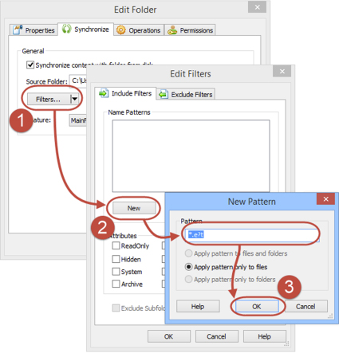
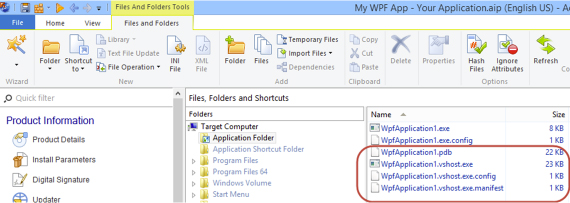

If you are syncing your Application Folder (or any other) with a local folder on a disk, you can specify which file or folders you want to sync. This is a very convenient way to keep your package smaller and clean.

Here is how you do it:

<!--endintro-->

1. Right click the
   **Application Folder** and choose
   **Properties**
2. Click on Filters button to open the
   **Edit Filters** dialog
3. Click on
   **New** button to create Include pattern. Alternatively you can switch to
   **Exclude Filters** tab
4. Enter the Pattern and press
   **OK** on each screen

::: bad  
  
:::

::: good  
  
:::
