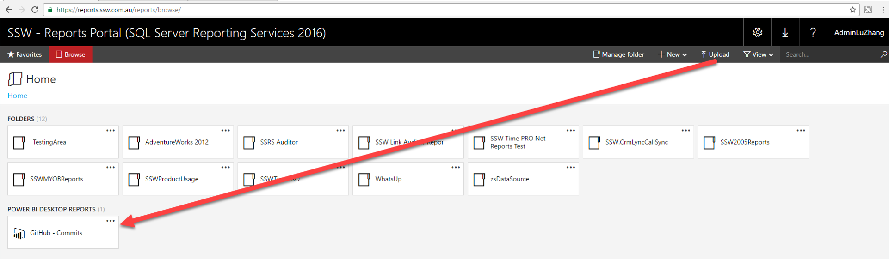
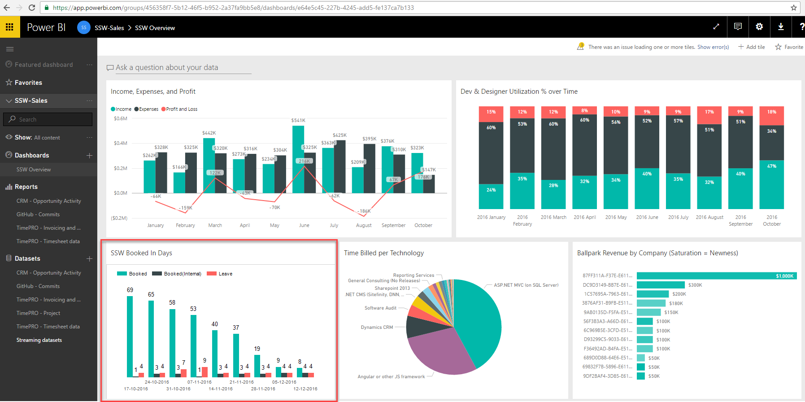

There are 2 ways to integrate Power BI with SSRS (SQL Reporting Services) that will allow you to be able to find all of your relevant reports from wherever you look for them

<!--endintro-->

::: good
In SSRS 2016, you can list Power BI reports as if they were SSRS ones.  
:::

::: good
Figure - Good Example: Power BI dashboards can show charts from SSRS reports, and link through to them when clicked.  
:::
