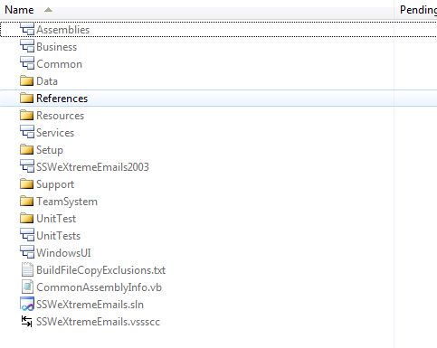
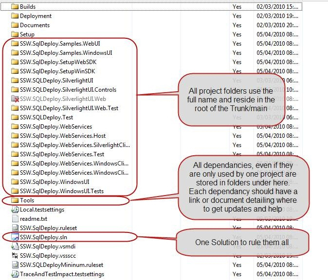

Whenever we setup a new Team Project we implement a basic version control structure. We put "readme.txt" files in the folder structure explaining the different levels, and a solution file called `[Client].[Product].sln?` located at `?/[Client]/[Product]/DEV/` within version control.

<!--endintro-->

::: bad  
  
:::

::: good  
  
:::
