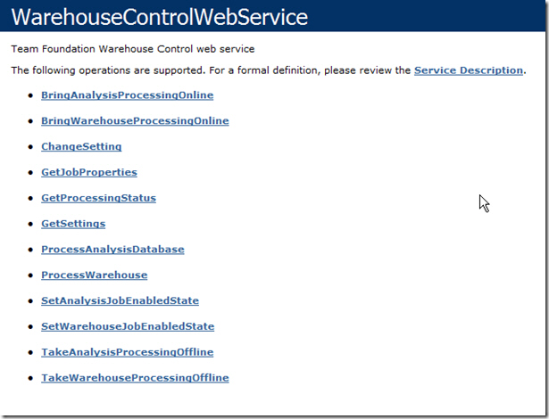

The cube is by default refreshed every two hours, but what is you are about to go into a status meeting and you want up to date reports?

You can refresh the cube manually using the web services, but only from the TFS server:

<!--endintro-->

Read [Refresh the TFS Warehouse manually](http://www.ewaldhofman.nl/post/2009/11/25/Refresh-the-TFS-Warehouse-manually.aspx) for more detail.
