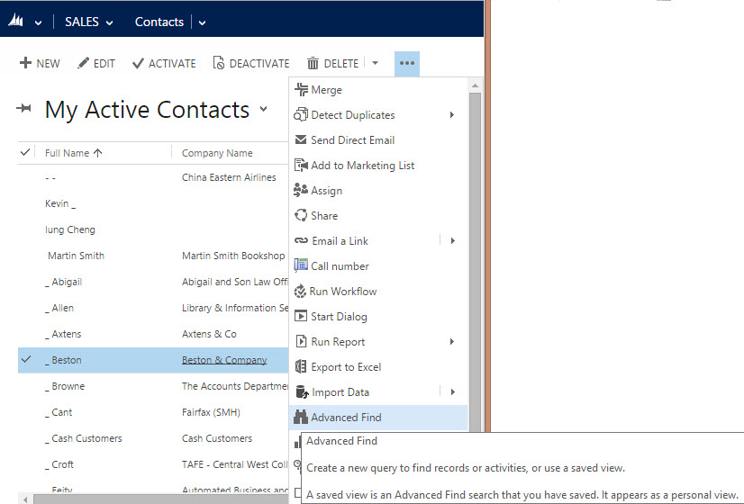
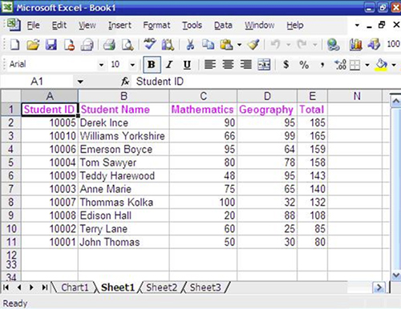
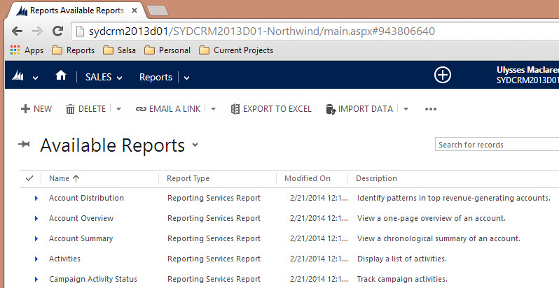

The data stored in CRM is useful on two counts. Firstly, it gives you a single source of truth for all customer related data. Secondly, you now have the ability to report on this data.

<!--endintro-->

::: good  
  
:::
**Figure: Advanced find is the easiest way to filter your data in CRM**

::: good  
  
:::

::: good  
  
:::
