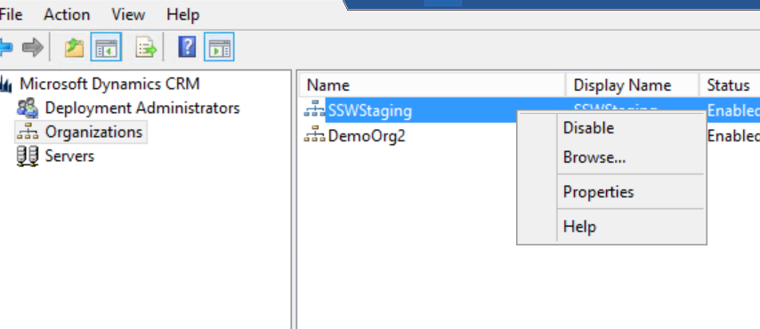
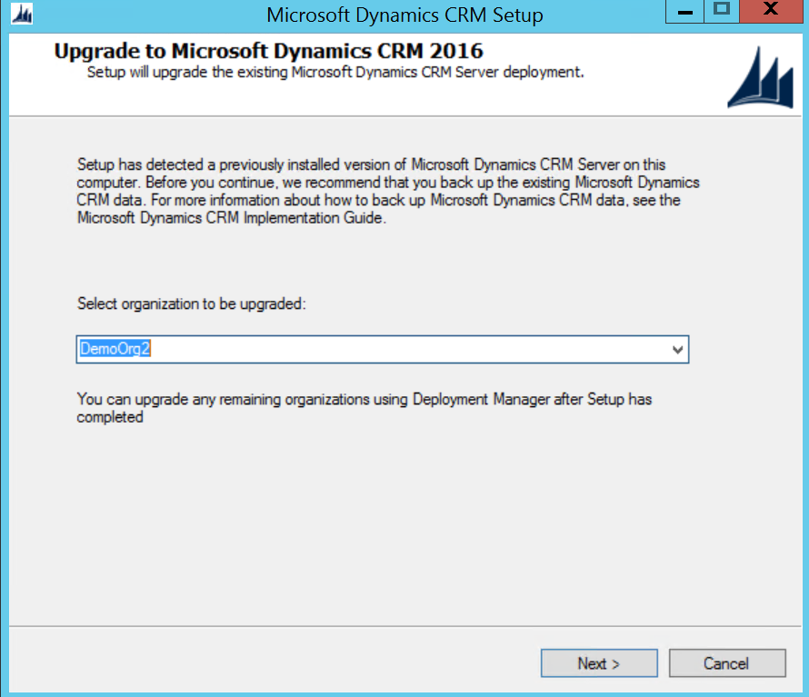
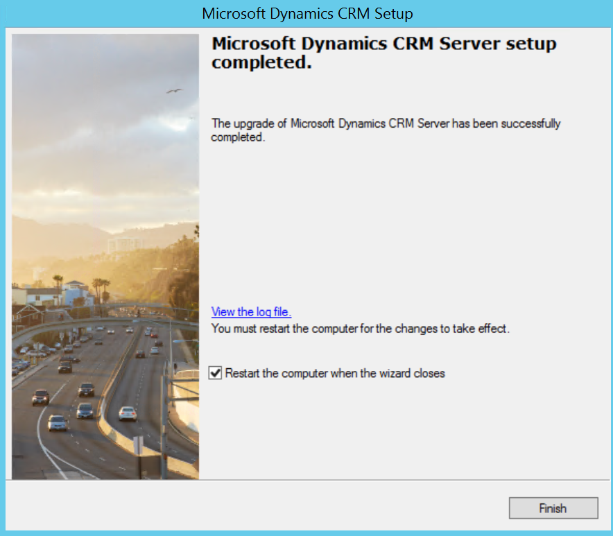
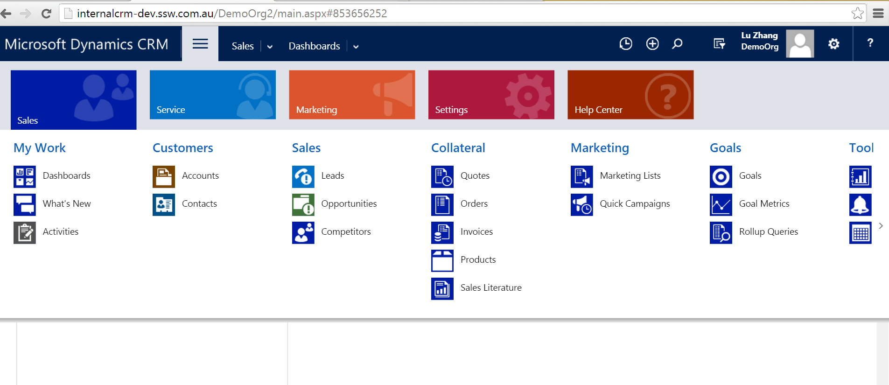
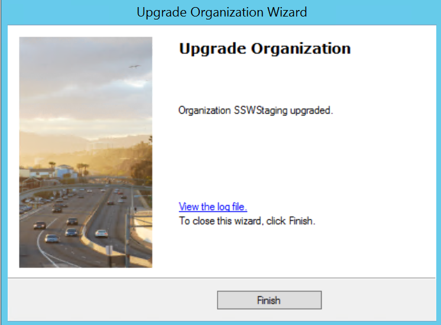
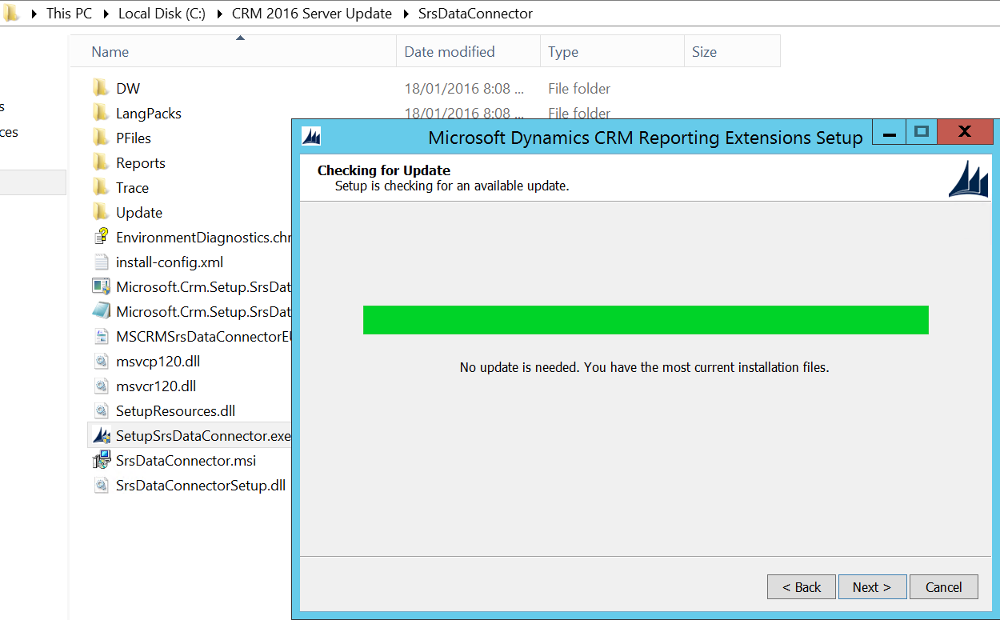
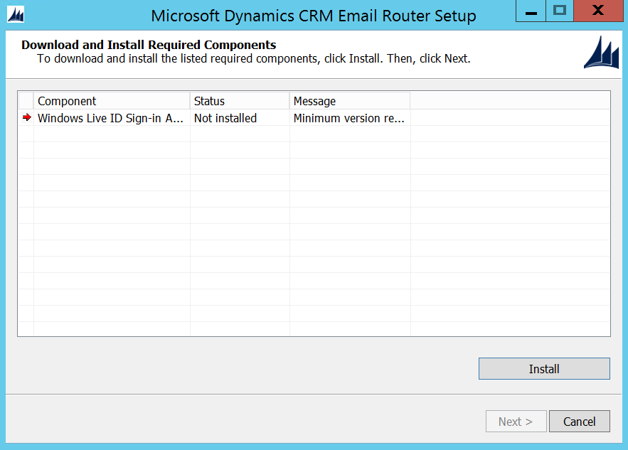
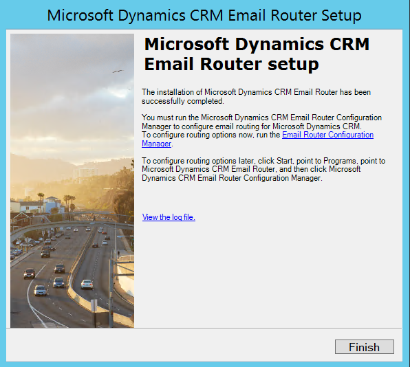

CRM 2016 has many improvements over it's predecessors, including Power BI integration, improved navigation, and the new Outlook extension.

The procedure for upgrading CRM 2015 to 2016 is:

<!--endintro-->

1. Apply Windows Update on CRM and Database servers

2. Go to CRM server | Deployment Manager | Disable CRM organization
   

3. Back up CRM organization database and configuration database

4. Go to CRM server | Control Panel | Uninstall "Microsoft Dynamics CRM Reporting Extensions"
   

5. Download [CRM 2016 Server installation file](https://www.microsoft.com/en-us/download/details.aspx?id=50372&WT.mc_id=DX-MVP-33518) and start the upgrade

   

   **Note:** It's better to have an empty demo organization to be upgraded first, so that you can test if the server upgrade has no issues.

   
   
   
   

7. Go to CRM setup directory | SrsDataConnector | Install 'Microsoft Dynamics CRM Reporting Extensions"
   
   

::: info
If using Email Router, do the following 2 steps to upgrade Email Router to 2016
:::

7. Go to CRM server | Uninstall "Microsoft Dynamics CRM 2015 Email Router"
   

8. Download [CRM 2016 Email Router](https://www.microsoft.com/en-us/download/details.aspx?id=50373&WT.mc_id=DX-MVP-33518) and install
   
   
   

You're now ready to roll with Microsoft Dynamics CRM 2016. If you had any trouble with this guide, please let us know with a rating of this rule.
