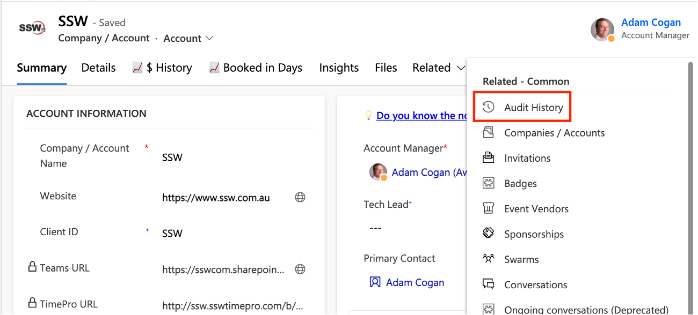
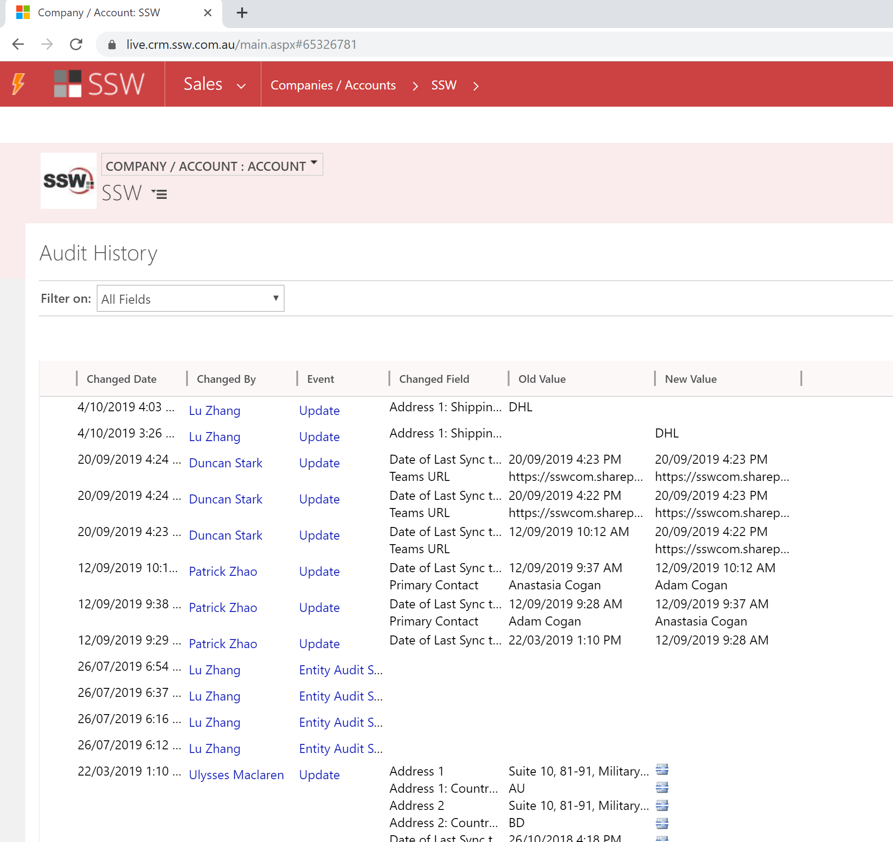

CRM provides the **Audit History** page to show the changes made to a CRM entity, You can use this page for auditing purposes.

<!--endintro-->

When you are browsing an entity, from the menu you will see an Audit History option when you have the permission.

Click the "Audit History" menu item, then you will be able to see the changes made to an entity.

