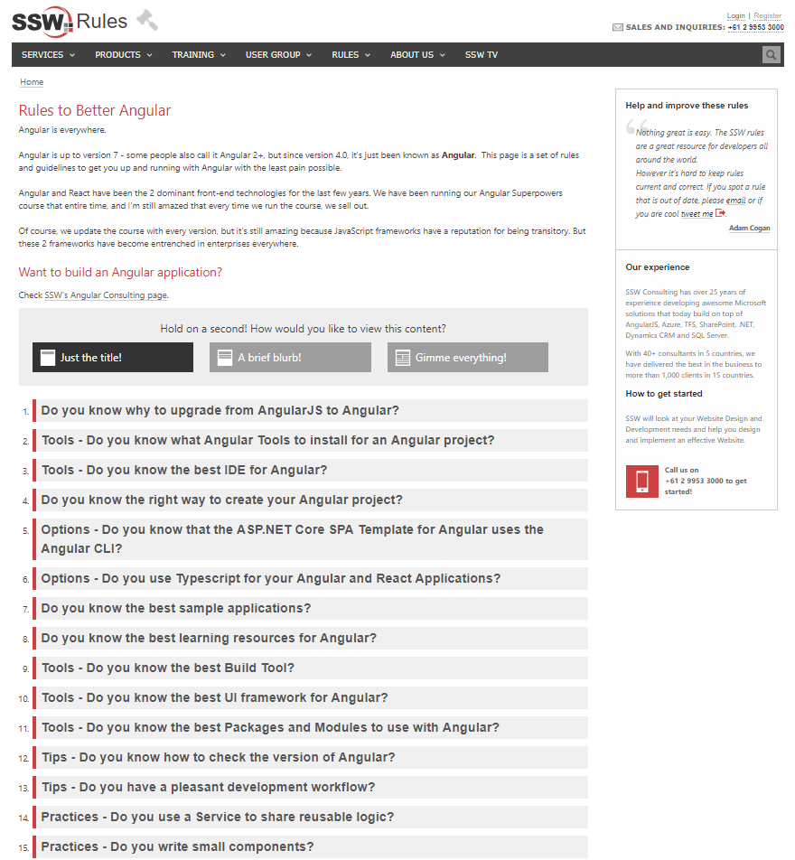

Content is essential! If you want to be found in the top results on Google, you must choose the best keywords for your target audience. First, you must do some research on what your target audience is looking for and then focus on making great content for your website that is related to these keywords. This will help your domain to be recognized as an authority (especially if are blogging too). You can use the [Google Keyword Planner](https://ads.google.com/intl/en_au/home/tools/keyword-planner/) to help with this, which is a free and helpful tool built into your Google Ads account that can show you how a list of keywords might perform.

<!--endintro-->

::: good
Figure: Good Example – Angular rule updated! Adding new content or updating your webpages gives you good Google juice and it has the main keyword for “Angular” in the title and throughout the content making it easier for a search engine to find. Google loves this!  
:::
