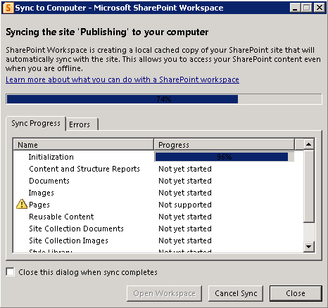

In SharePoint 2010, there are quite a few tools that we can use to take SharePoint data offline. Let’s look at our options:

- use Outlook to synchronize document libraries, calendar and contacts offline.
- use Excel to take read-only copies of list data offline.
- use Access to take list data offline – Access also lets you edit offline and synchronize back.
- use SharePoint Workspace (this was Groove) to take entire Site offline, unfortunately this doesn’t work for calendars.

<!--endintro-->

We think the best way is to use Workspace instead of Outlook:

1. SharePoint Workspace synchronize an entire site

   a. So when lists are renamed it knows about it.

   b. It also knows about new lists that are added to a SharePoint site  **Figure: SharePoint Workspace synchronizing an entire site**

2. Outlook can be quite busy when synchronizing to Exchange server; it is good to not burden it with more work.

While SharePoint Workspace is quite good, we don’t like to store lists in it:

1. Access has better filtering, sorting options when offline
