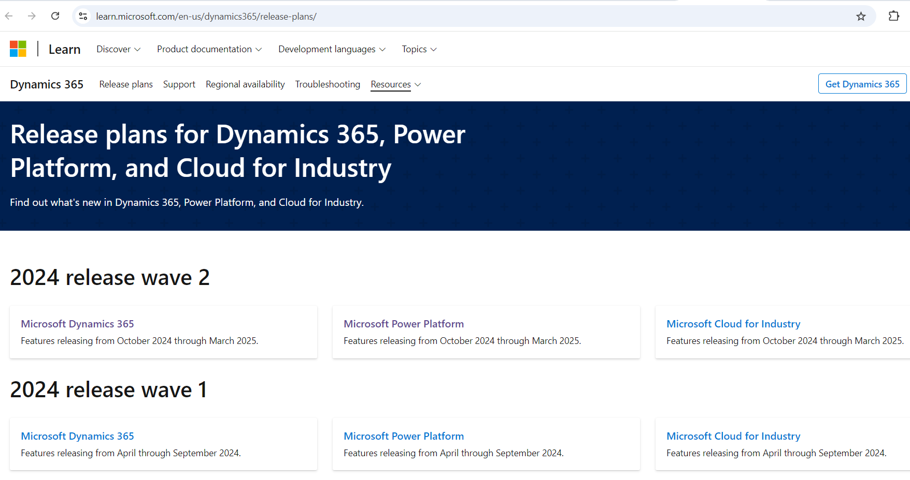

The Dynamics 365 Release plans provide a snapshot of what Microsoft has been working on in the Dynamics 365 CRM business. You can use it to find out what was recently made generally available, released into public preview, is still being developed and tested, or is no longer developed.

<!--endintro-->

