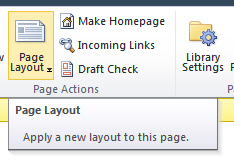
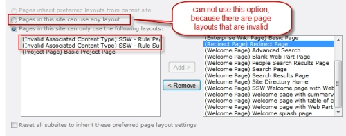
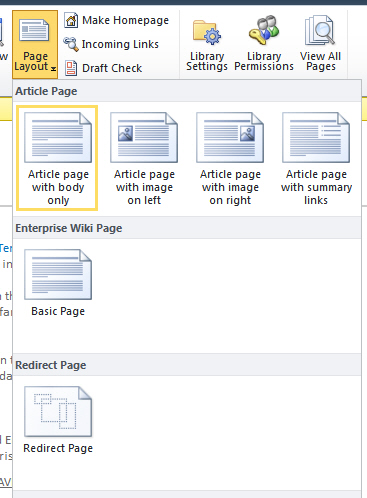

Follow the step to fix SharePoint JavaScript errors:

<!--endintro-->

1. Your content editor is trying to change page layout via the Ribbon in SharePoint 2010
   **Figure: Click Page Layout in the Ribbon**
2. But they get a JavaScript error
   Webpage error details

   User Agent: Mozilla/4.0 (compatible; MSIE 8.0; Windows NT 6.1; WOW64; Trident/4.0; SLCC2; .NET CLR 2.0.50727; .NET CLR 3.5.30729; .NET CLR 3.0.30729; Media Center PC 6.0; .NET4.0C; .NET4.0E; InfoPath.3)
   Timestamp: Wed, 22 Dec 2010 01:33:17 UTC
   Message: Object required
   Line: 2
   Char: 6422
   Code: 0
   URI:[http://intranet.ssw.com.au/\_layouts/cui.js?rev=wvoVpqlQb30nGo4DjDk8Kg%3D%3D](http://intranet.ssw.com.au/_layouts/cui.js?rev=wvoVpqlQb30nGo4DjDk8Kg%3D%3D)

This error is likely caused by SharePoint trying to render available page layouts for the page to switch to, but there is an error.
A very quick fix that can be applied by a site owner is:

1. Site Settings | Look and Feel | Page layouts and site templates
2. Restrict the valid number of page layouts that can be used, instead of allowing "Pages in this site can use any layout" **Figure: Restrict valid page layouts**
3. This fixes the Ribbon menu
    **Figure: Ribbon menu fixed!**
4. Tell your sys admin that there are broken packages in SharePoint and must be fixed ASAP
