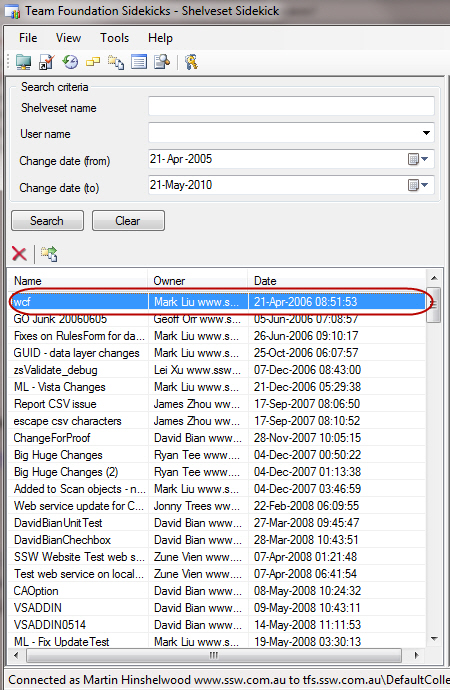

Shelveset’s are useful for keeping your code on the server when you are not ready to check in. They are even created to allow Gated Check-in to work. But where do they go?
Well, if you don’t delete your Shelves once you are done with them they hang around forever…

<!--endintro-->

**Figure: Yup, Mark wins again! He has the oldest Shelveset from 2006. But he is not the only one!**

Use the Shelveset Sidekick in [Team Foundation Sidekicks](http://www.attrice.info/cm/tfs/index.htm)at the end of every month to make sure you have not forgotten anything.
