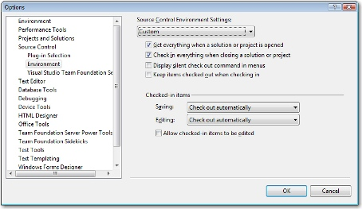
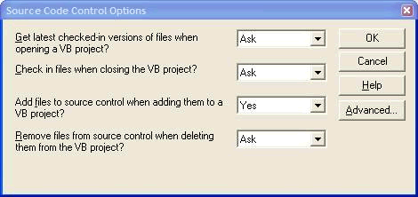
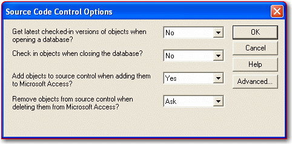
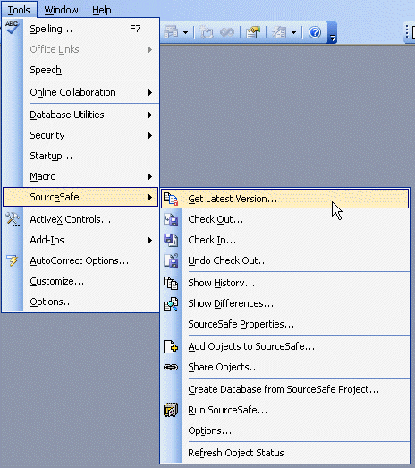

When working on a task spanning multiple files, do not check-in only one or two of the files, this leads to the problem of partial check-ins where references to new classes or methods are unavailable because they are in the files that haven't been checked in. So either, check-in all the files you are working on or none at all if you aren't finished working on the task.

<!--endintro-->

You know how frustrating it is when you want to fix an application and all the files are checked out by some one else!

Make Visual Studio remind you to check code in. In Microsoft Visual Studio. NET sharing project code can be configured by ticking the two checkboxes on top, in Options (from the Tools menu) as shows below.

## What about VB6 applications?

In Visual Basic 6 this is done by going through Tools -&gt; Source Safe -&gt; Options and setting it as shown in the diagram below.

## What about Access applications?

We also use VSS for Access projects. Access 2000 had problems with MDBs (not ADPs) but Access 2003 works fine with both. The only thing you have to be careful of is that if a form is not checked out, it still lets you modify the form, but when you close the form, it rolls back to the VSS version and you lose all of your changes.

**Note:** Using VSS in Microsoft Access has a few limitations, most significant of which is the inability to reattach to VSS projects.  Once you have detached from a VSS project, you will need to create a new VSS project in order to place the Access application back into VSS.

## What about SQL Server Databases?

We save the scripts of every SQL Server schema change in Source Control.
