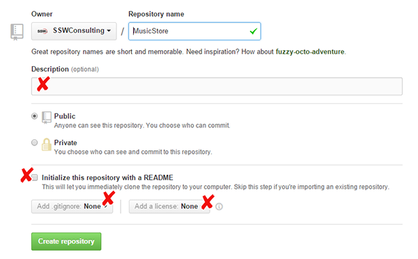

It is important when creating a new repository, to set it up correctly. Repositories without Descriptions, ReadMe files or licenses do not appear professionally built.

<!--endintro-->

::: bad  
  
:::

::: good  
  
:::
