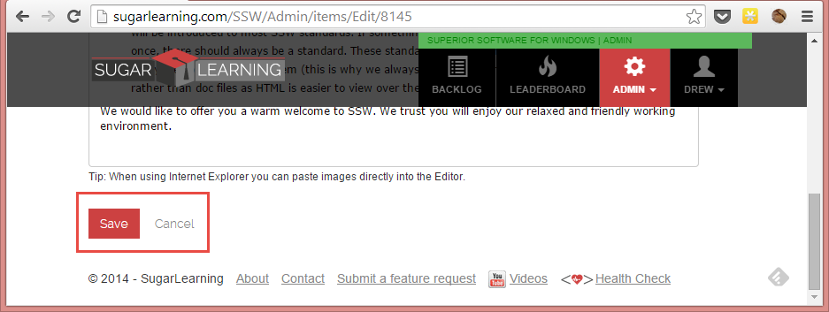
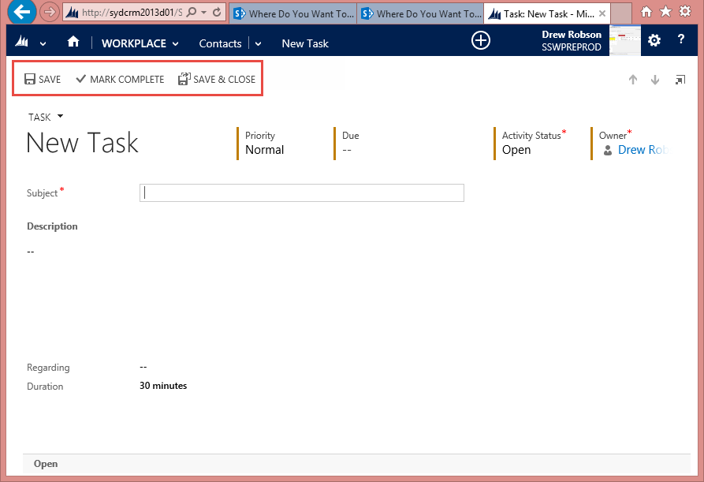
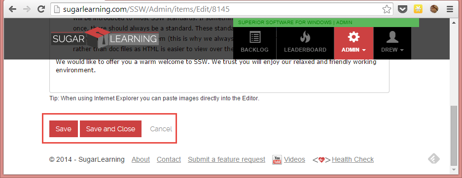

When the user is creating or editing data on a webpage, there are two buttons and one link you need to provide.

<!--endintro-->

So the options are:

* **Save** (button) - Saves the data and allows the user to keep editing
* **Save and Close** (button) - Saves the data and returns to the previous screen
* **Cancel** (link) - returns to the previous screen

::: bad

:::

::: good

:::

::: good

:::
