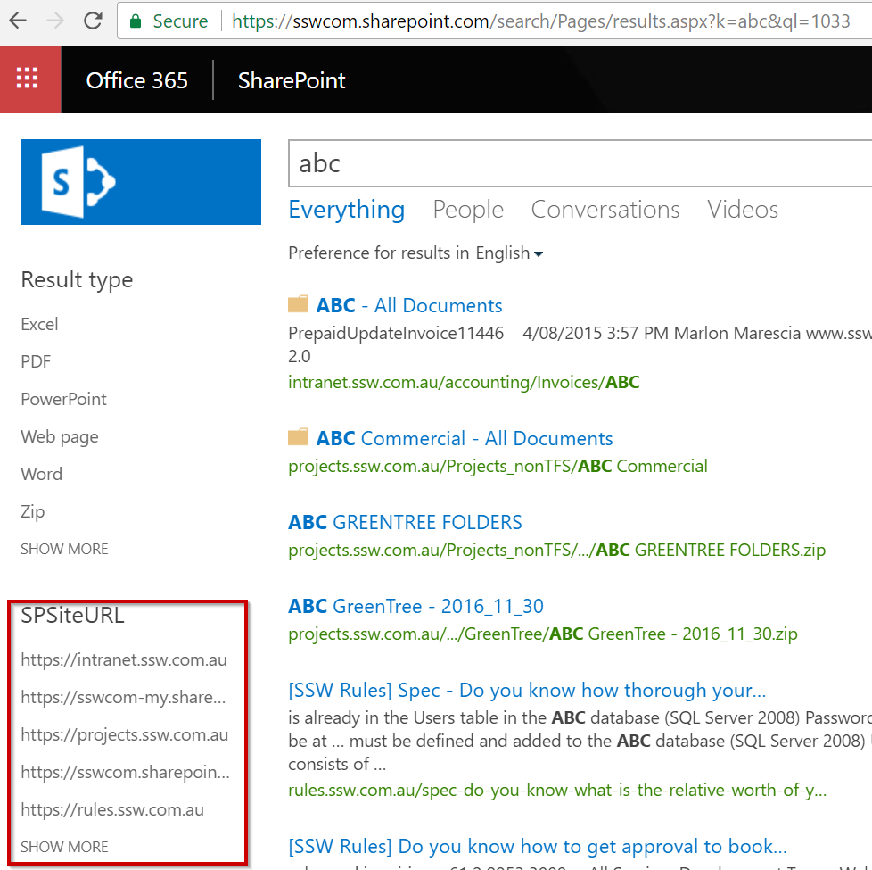

Although Sharegate migration tool works very well to help you with your SharePoint migration, some manual steps might be necessary to complete the migration. These extra steps include:

<!--endintro-->

- Configuring any custom Search scopes/refinements
- Remove permissions from On-premise Intranet (or turn it to Read-Only)
- Ask users to change their mapped folders
- Communicate about the changes

