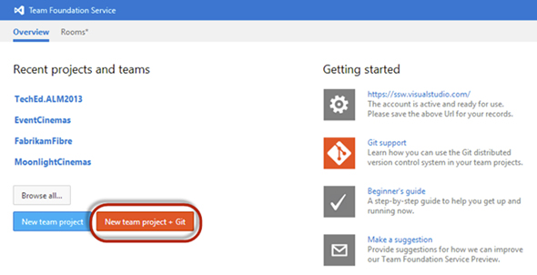

Team Foundation Server Update 2 and Team Foundation Server 2013 comes with built in support for Git as a version control system.

<!--endintro-->

You should use Git if you:

* Are running an open source project
* Have lots of remote team members (as you get offline repo access with full history)
* Have an unstable/sporadic internet connection
* Develop in a non Microsoft environment (e.g. Linux, OSX)

There are also several disadvantages:

* No "My Work" view in Team Explorer
* No "Code Review" integration in Visual Studio
* No "Check in Policies"
* No SOX, FDA or CFD-11 compliance

At this point, SSW still recommends Team Foundation Version Control (TFVC) as the version control system of choice.
