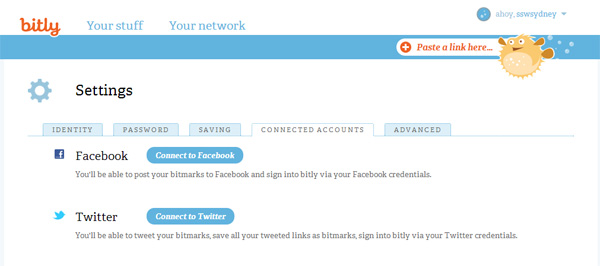

You should link all your accounts (available at the moment: Twitter and Facebook) to your bit.ly account. This can be done under the ["Connected Account" tab](https://bitly.com/a/settings/connected).

<!--endintro-->

::: info
**Tip:** If you are trying to [share a URL on LinkedIn that is longer than 26 characters](https://www.linkedin.com/help/linkedin/answer/3439), LinkedIn will automatically shorten it once you click Post, to make it easier for the user to read. It happens either if you have text before or after the URL you are sharing. If you're sharing an article and there’s no text after the link, it will be hidden from the share too.
:::
