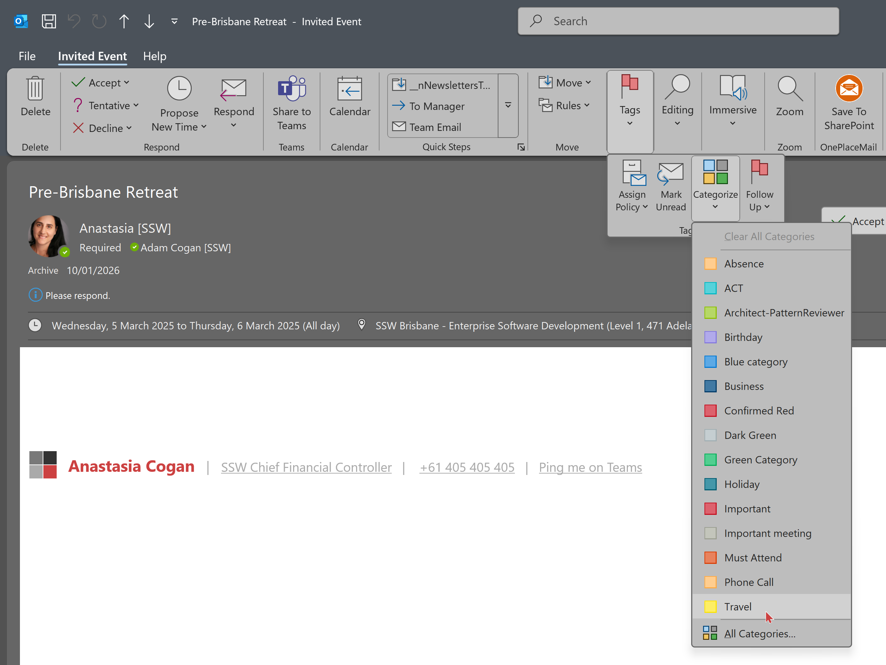
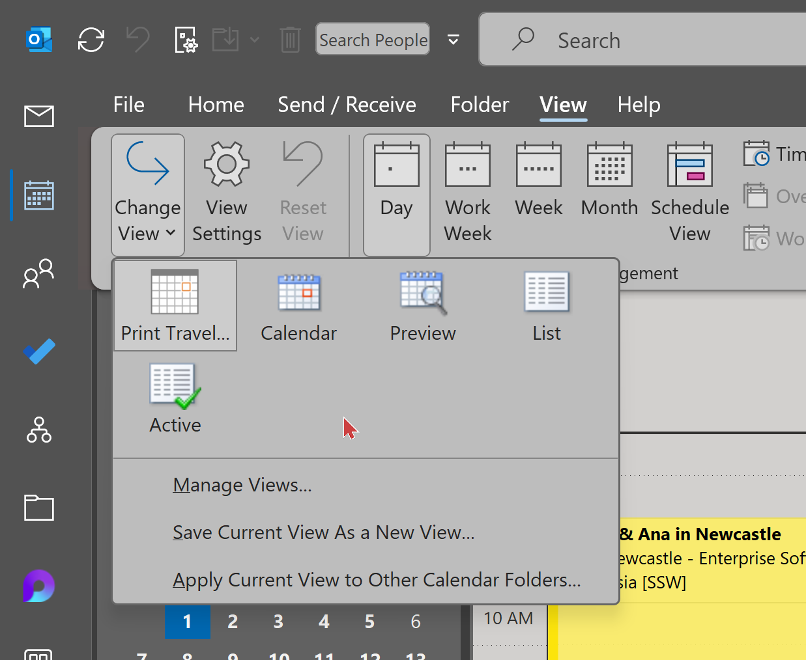
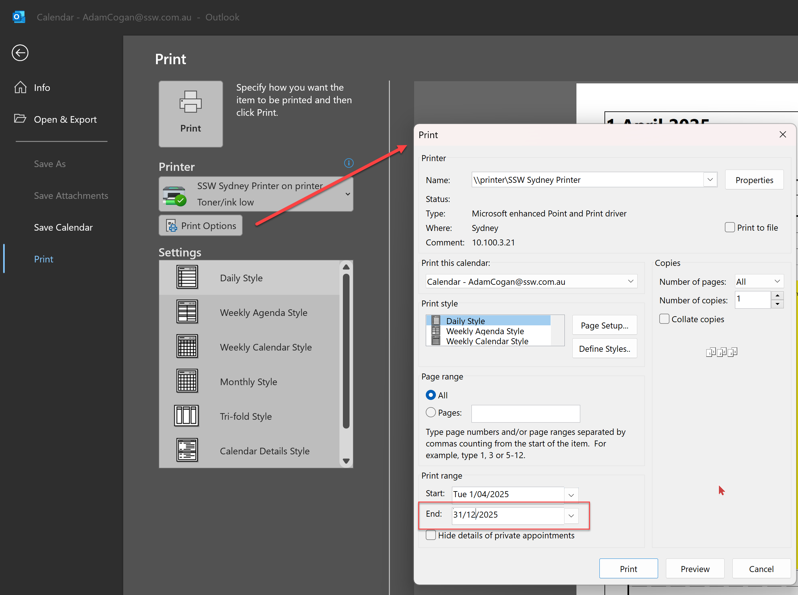
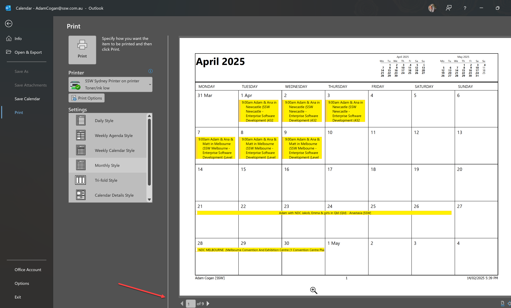

\
\
Travel schedules can get complicated, especially when managing multiple trips or coordinating with team members. Relying solely on digital calendars can lead to missed details, especially when internet access is limited or when navigating multiple time zones. Having a printed version of your travel schedule can be a lifesaver in these situations.

<!--endintro-->

## Why It Matters

Printed travel schedules provide several benefits:

* **Quick Access:** No need to unlock devices or search through apps – just pull out the paper.
* **Reliability:** Battery life or technical issues won't hinder your ability to check your itinerary.
* **Comprehensive Overview:** Seeing your schedule on paper allows for a better overview, making it easier to spot conflicts or gaps.
* **Backup Plan:** If your device is lost or damaged, you still have your travel details on hand.

## How to Do It Right

1. **Plan in Advance:** Print your schedule at least a week before your trip to allow time for last-minute changes.
2. **Organize for Easy Access:** Use a travel folder or planner to keep the schedule organized along with other important documents like boarding passes and travel insurance.
3. **Update as Needed:** If plans change, update the schedule and reprint the necessary pages.

## Step by Step









## Notes

* If you want to view your boss's calendar to edit:
  * To give somebody else permissions to your calendar - right click on calendar | sharing and permissions. From there you can select someone to give permissions to.  
  * Alternatively, ask a SysAdmin - This had to be done in PowerShell – as per: <https://learn.microsoft.com/en-us/powershell/module/exchange/add-mailboxfolderpermission?WT.mc_id=M365-MVP-33518>
  * The command is
```Add-MailboxFolderPermission -Identity {{ BOSS'S EMAIL }}:\Calendar -User {{ YOUR EMAIL }} -AccessRights Editor```
* In the new Outlook, you cannot print your boss's calendar
  * Even though you can add categories, you cannot filter based on the boss's categories (as you only see your own filters in the filters list). Therefore you need to print from your boss's Outlook.
