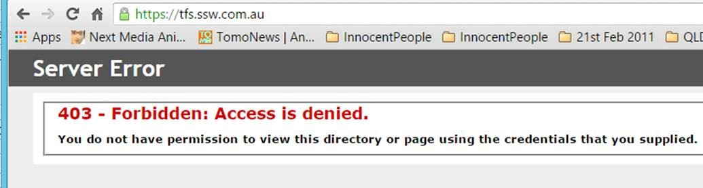
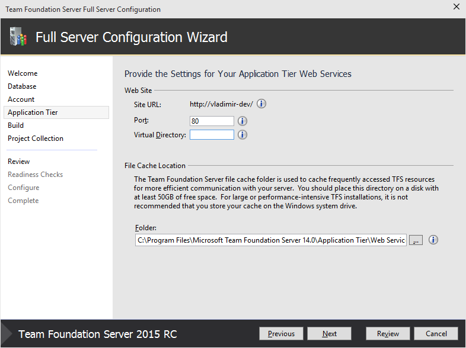
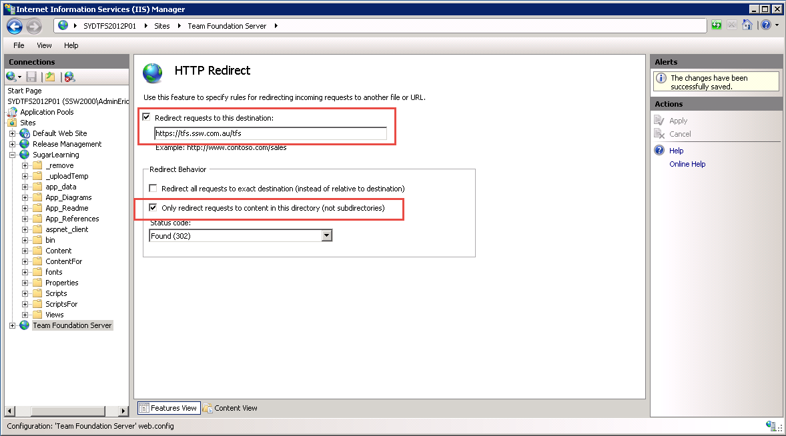

Many clients that complain when they type: **tfs.northwind.com**
...and then see ‘Server Error 403 – Forbidden: Access is denied’

It is not a nice experience that in 2015 the out-of-the-box requirement is still to type "/tfs".

<!--endintro-->

::: bad  
  
:::

So fix the nasty out-of-the-box experience.

