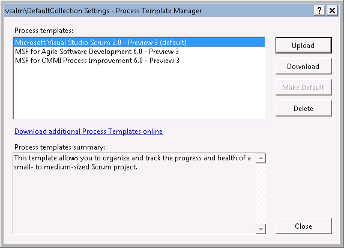

TFS 2012 includes 3 built-in process templates:

Figure: built-in process templates in TFS 2012Instead of starting from scratch, you should always choose one of these built-in templates to do your own customization. It will depend on the target process for you to choose which one, for small and simple process, Scrum and Agile templates are recommended; for formal and complex process, choose the CMMI template.

<!--endintro-->

Using an existing process template will save you a lot of time because

* It has the structure setup already, all you need to do is to make modifications and upload the template back to the server again.
* All the built-in reports could be used as a template for your customization, this will save you a lot of time from creating a new report.
