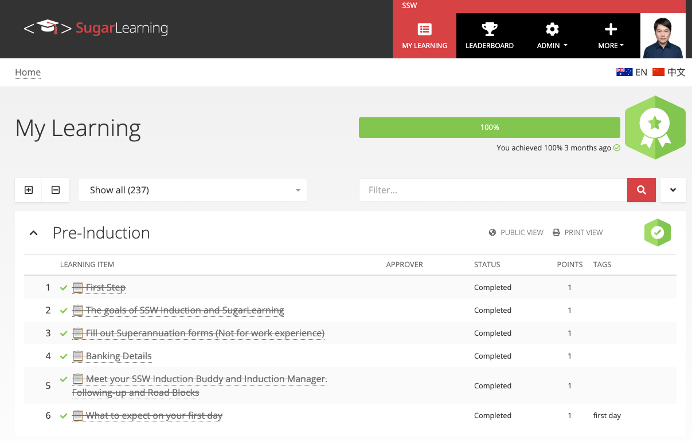
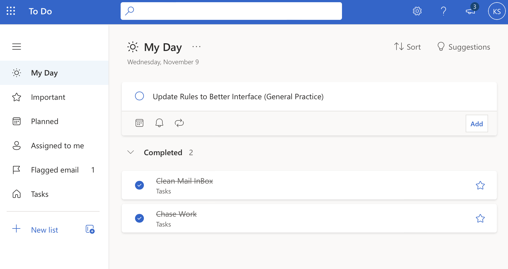

When you're giving an update on progress on a task list or a schedule, ~~strike out~~ the items that have been completed. Not only does it visually explain where you are, it also gives you a great sense of satisfaction...

<!--endintro-->

::: good

:::

::: good

:::
