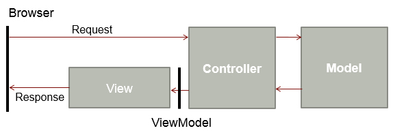
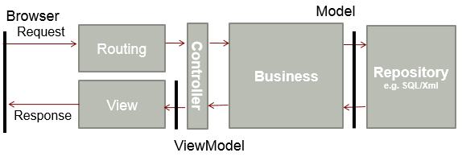

Understanding the Enterprise MVC request process is crucial for ensuring smooth operations, efficient handling of requests, and alignment with organizational goals. It enables timely delivery and keeps everyone well-informed throughout the process.

<!--endintro-->

::: bad

:::

::: good

:::
