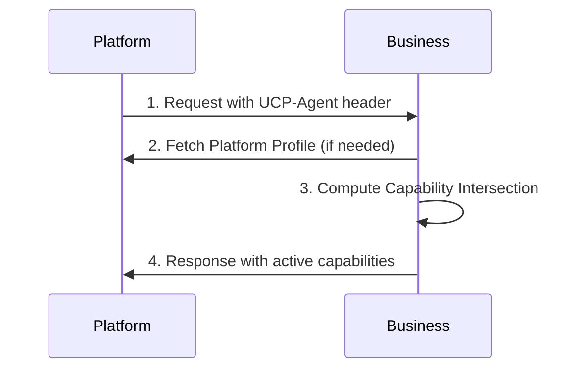

The web has evolved how systems discover what they can do with each other. Just as robots.txt tells crawlers what they CAN'T access, and llms.txt tells AI models what they SHOULD know, UCP profiles tell commerce partners what they CAN do with your business.

Businesses struggle with building custom integrations for every platform, every payment provider, every AI agent. This N-to-N integration problem creates fragmented commerce experiences and abandoned carts. UCP solves this with standardized discovery, like a universal business card for commerce.

<endIntro />


<boxEmbed
  style="info"
  body={<>
    **Note:** UCP (Universal Commerce Protocol) was announced in January 2026 and is a new, evolving standard. While the core concepts are stable, specific implementation details may change as the protocol matures. Always refer to the [official UCP specification](https://ucp.dev/latest/) for the most current information.
  </>}
  figurePrefix="none"
  figure=""
/>


## Discovery Files Evolution

Think of discovery files as public signs for different types of visitors:

**robots.txt (1994)**: Tells web crawlers "DON'T go here"
```text
User-agent: *
Disallow: /admin/
Disallow: /private/
```

**llms.txt (2024)**: Tells AI models "KNOW this about me"  
```text
# Business Summary
SSW is a software consulting company...
```

**UCP Profile (2026)**: Tells commerce partners "HERE'S what you can do with me"

```json
{
  "ucp": {
    "version": "2026-01-11",
    "services": {
      "dev.ucp.shopping": [{
        "transport": "rest",
        "endpoint": "https://api.example.com/ucp/v1"
      }]
    },
    "capabilities": {
      "dev.ucp.shopping.checkout": [{
        "version": "2026-01-11"
      }]
    }
  }
}
```

This evolution shows how we're moving from restrictions (robots.txt) to permissions (llms.txt) to capabilities (UCP).

## Server-Side Discovery (/.well-known/ucp)

Businesses publish their UCP profile at a standard location, just like robots.txt.

### Bad Example - Missing Profile

```none
GET /.well-known/ucp
404 Not Found
```

**❌ Figure: Bad example - No UCP profile means platforms can't discover your capabilities**

### Good Example - Complete Profile

```json
{
  "ucp": {
    "version": "2026-01-11",
    "services": {
      "dev.ucp.shopping": [
        {
          "version": "2026-01-11",
          "spec": "https://ucp.dev/specification/overview",
          "transport": "rest",
          "endpoint": "https://business.example.com/ucp/v1",
          "schema": "https://ucp.dev/services/shopping/rest.openapi.json"
        },
        {
          "version": "2026-01-11",
          "spec": "https://ucp.dev/specification/overview",
          "transport": "mcp",
          "endpoint": "https://business.example.com/ucp/mcp",
          "schema": "https://ucp.dev/services/shopping/mcp.openrpc.json"
        },
        {
          "version": "2026-01-11",
          "spec": "https://ucp.dev/specification/overview",
          "transport": "a2a",
          "endpoint": "https://business.example.com/.well-known/agent-card.json"
        },
        {
          "version": "2026-01-11",
          "spec": "https://ucp.dev/specification/overview",
          "transport": "embedded",
          "schema": "https://ucp.dev/services/shopping/embedded.openrpc.json"
        }
      ]
    },
    "capabilities": {
      "dev.ucp.shopping.checkout": [
        {
          "version": "2026-01-11",
          "spec": "https://ucp.dev/specification/checkout",
          "schema": "https://ucp.dev/schemas/shopping/checkout.json"
        }
      ],
      "dev.ucp.shopping.fulfillment": [
        {
          "version": "2026-01-11",
          "spec": "https://ucp.dev/specification/fulfillment",
          "schema": "https://ucp.dev/schemas/shopping/fulfillment.json",
          "extends": "dev.ucp.shopping.checkout"
        }
      ],
      "dev.ucp.shopping.discount": [
        {
          "version": "2026-01-11",
          "spec": "https://ucp.dev/specification/discount",
          "schema": "https://ucp.dev/schemas/shopping/discount.json",
          "extends": "dev.ucp.shopping.checkout"
        }
      ],
      "dev.ucp.common.identity_linking": [
        {
          "version": "2026-01-11",
          "spec": "https://ucp.dev/specification/identity-linking",
          "schema": "https://ucp.dev/schemas/common/identity_linking.json"
        }
      ]
    },
    "payment_handlers": {
      "com.example.processor_tokenizer": [
        {
          "id": "processor_tokenizer",
          "version": "2026-01-11",
          "spec": "https://example.com/specs/payments/processor_tokenizer",
          "schema": "https://example.com/specs/payments/processor_tokenizer.json"
        }
      ]
    },
    "signing_keys": [
      {
        "kid": "business_2025",
        "kty": "EC",
        "crv": "P-256",
        "x": "WbbXwVYGdJoP4Xm3qCkGvBRcRvKtEfXDbWvPzpPS8LA",
        "y": "sP4jHHxYqC89HBo8TjrtVOAGHfJDflYxw7MFMxuFMPY",
        "use": "sig",
        "alg": "ES256"
      }
    ]
  }
}
```

**✅ Figure: Good example - Complete UCP profile at standard location announces all capabilities**

The profile announces:
- **Services**: What API surfaces are available (REST, MCP, A2A, EP)
- **Capabilities**: What specific commerce operations you support
- **Payment Handlers**: How partners can process payments with you

## Client-Side Advertisement (UCP-Agent Header)

Platforms advertise themselves in every request so businesses know who they're dealing with.

### Bad Example - No Client Advertisement

```http
POST /checkout HTTP/1.1
Content-Type: application/json

{
  "line_items": [{"id": "item1", "quantity": 1}]
}
```

**❌ Figure: Bad example - No UCP-Agent header means business can't identify platform capabilities**

### Good Example - Proper Client Advertisement

```http
POST /checkout HTTP/1.1
UCP-Agent: profile="https://agent.example.com/profiles/shopping-agent.json"
Content-Type: application/json

{
  "line_items": [{"id": "item1", "quantity": 1}]
}
```

**✅ Figure: Good example - UCP-Agent header tells business which platform is making request**

For MCP (Model Context Protocol), the profile is included in the request metadata:

```json
{
  "jsonrpc": "2.0",
  "method": "create_checkout",
  "params": {
    "meta": {
      "ucp-agent": {
        "profile": "https://agent.example.com/profile.json"
      },
      "idempotency-key": "550e8400-e29b-41d4-a716-446655440000"
    },
    "checkout": {
      "line_items": [{"id": "item1", "quantity": 1}]
    }
  },
  "id": 1
}
```

## Capability Negotiation Process

UCP uses a "server-selects" model where businesses choose from the intersection of capabilities.



The business response always includes what capabilities are active:

```json
{
  "ucp": {
    "version": "2026-01-11",
    "capabilities": {
      "dev.ucp.shopping.checkout": [{"version": "2026-01-11"}],
      "dev.ucp.common.identity_linking": [{"version": "2026-01-11"}]
    },
    "payment_handlers": {
      "com.example.processor_tokenizer": [{"id": "processor_tokenizer", "version": "2026-01-11"}]
    }
  },
  "id": "checkout_123",
  "status": "ready_for_complete"
}
```

## Transport Selection Guidelines

Choose your transport based on use case:

| Transport | Best For | Example Use |
|-----------|------------|--------------|
| **REST** | Traditional web applications | React/Angular apps calling your API |
| **MCP** | AI agents and LLMs | ChatGPT, Claude integrating commerce |
| **A2A** | Agent-to-agent automation | Backend systems talking directly |
| **embedded** | Embedded checkout UI | Iframe checkout in existing site |

### Bad Example - Wrong Transport Choice

```javascript
// Using REST for AI agent integration
const checkout = await fetch('/api/checkout', {
  method: 'POST',
  headers: {'Content-Type': 'application/json'},
  body: JSON.stringify(checkoutData)
});
```

**❌ Figure: Bad example - REST adds complexity for AI agent scenarios**

### Good Example - Appropriate Transport

```javascript
// Using MCP for AI agent integration  
const agent = new MCPClient();
const checkout = await agent.call('create_checkout', {
  checkout: checkoutData,
  meta: {
    "ucp-agent": {
      "profile": "https://agent.example.com/profile.json"
    }
  }
});
```

**✅ Figure: Good example - MCP provides natural AI agent integration**

## Implementation Checklist

- [ ] **Publish Profile**: Create `/.well-known/ucp` endpoint
- [ ] **Advertise Client**: Include `UCP-Agent` header in all requests
- [ ] **Validate Namespaces**: Ensure spec URLs match namespace authorities  
- [ ] **Cache Profiles**: Respect HTTP cache-control directives
- [ ] **Handle Negotiation**: Compute capability intersections correctly
- [ ] **Select Transport**: Choose REST/MCP/A2A/EP based on use case

## Resources

- [UCP Official Specification](https://ucp.dev/latest/)
- [UCP Discovery Guide](https://ucp.dev/latest/specification/overview/#discovery-governance-and-negotiation)
- [Related: Do you use MCP to standardize LLM connections?](/rules/use-mcp-to-standardize-llm-connections)
- [Related: Rules to Better Web API](/categories/software-engineering/rules-to-better-web-api.mdx)

UCP profiles are the missing piece in commerce interoperability. Just as robots.txt and llms.txt solved discovery for web crawlers and AI models, UCP solves it for commerce systems.