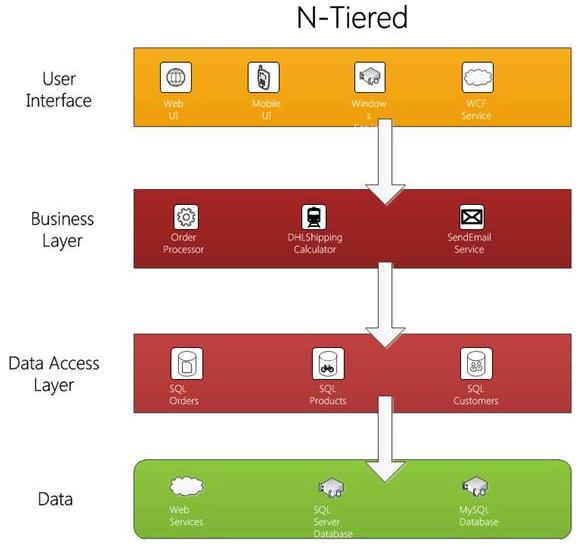
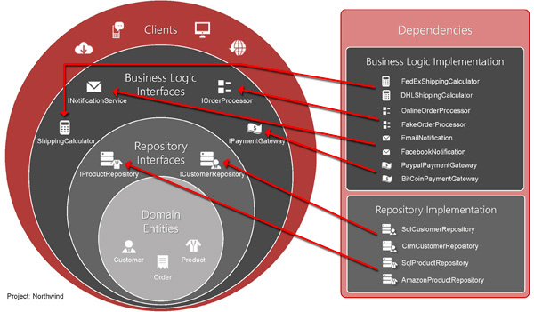

The classes in each layer can depend on layers toward the center. It emphasizes the use of interfaces for the business logic and repository layers.

The repository layer corresponds to the Data Access Layer in an n-Tier architecture. An n-Tier architecture has at its base the database.

The core of the onion architecture is the Domain Model, and all dependencies are injected. This leads to more maintainable applications since it emphasizes the separation of concerns.

<!--endintro-->

::: bad  
  
:::

::: good  
  
:::
