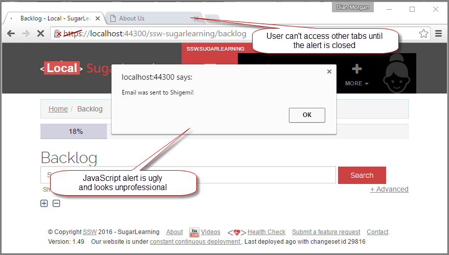
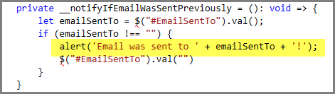
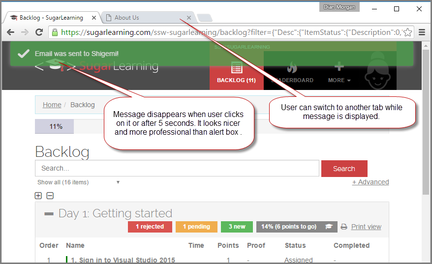
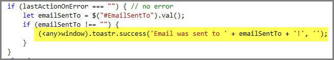

JavaScript alerts are evil. Not only are they ugly, they look unprofessional...

<!--endintro-->

::: bad
Bad example: A JavaScript alert showing a message to the user  
:::

::: bad
Bad example: The alert(".....") is the evil code

:::

::: good
Good example: The message in green is rendered as Html  
:::

::: good
Good example: In this example, [Toaster](https://github.com/CodeSeven/toastr)is used  
:::
