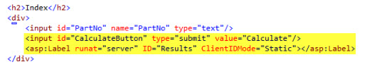
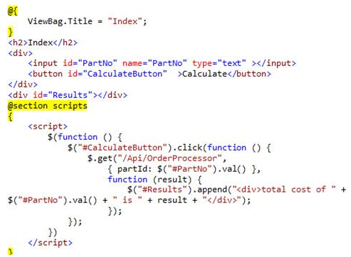

You should build a responsive UI using jQuery and a Web API.

<!--endintro-->

 Bad Example – Posting the whole form in a submit requires the whole page to be posted to the server  Figure: Good Example - Using jQuery to call the Web API provides a great user experience. The whole page does not need to be posted to the server
