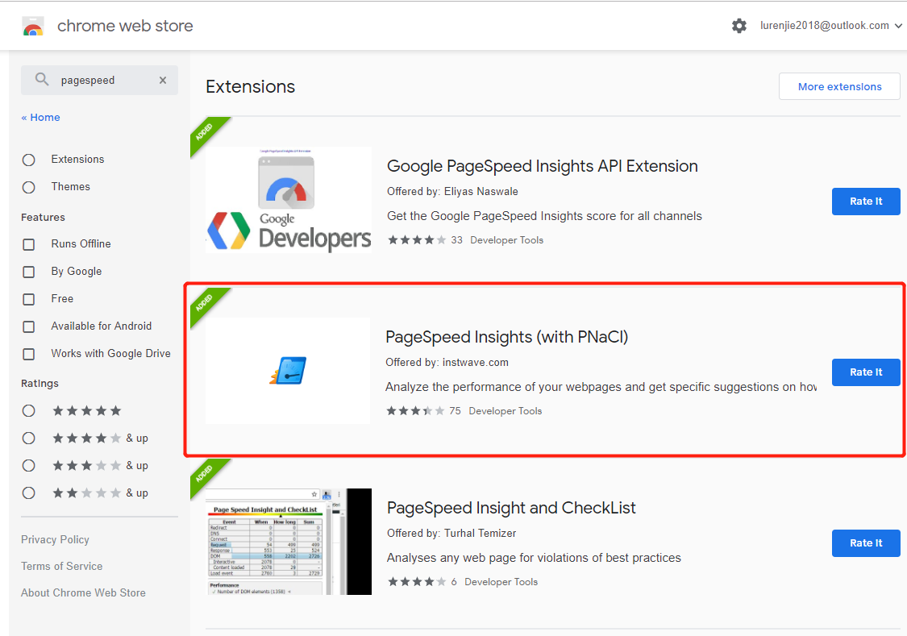
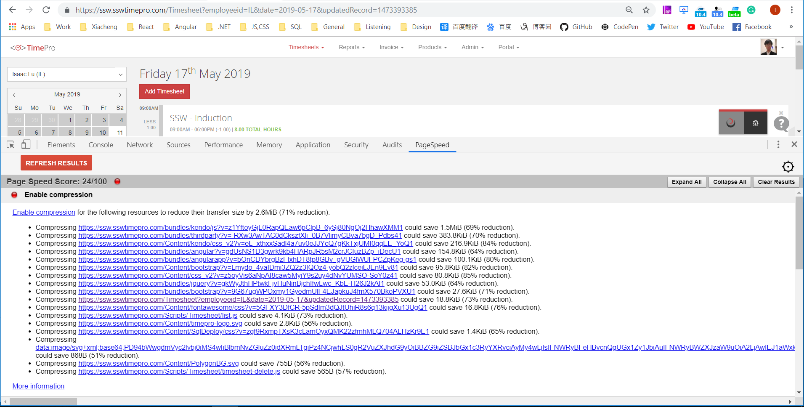

PageSpeed can analyze the performance of your webpages and get specific suggestions on how to optimize them.

<!--endintro-->

## How to install PageSpeed?

Install PageSpeed from [Chrome web store](https://chrome.google.com/webstore/detail/pagespeed-insights-with-p/lanlbpjbalfkflkhegagflkgcfklnbnh?hl=en-GB).

## How to use PageSpeed?

In Developer Tools (F12), you will have a new tab named PageSpeed.

The result of the analysis will be displayed in the PageSpeed tab.

