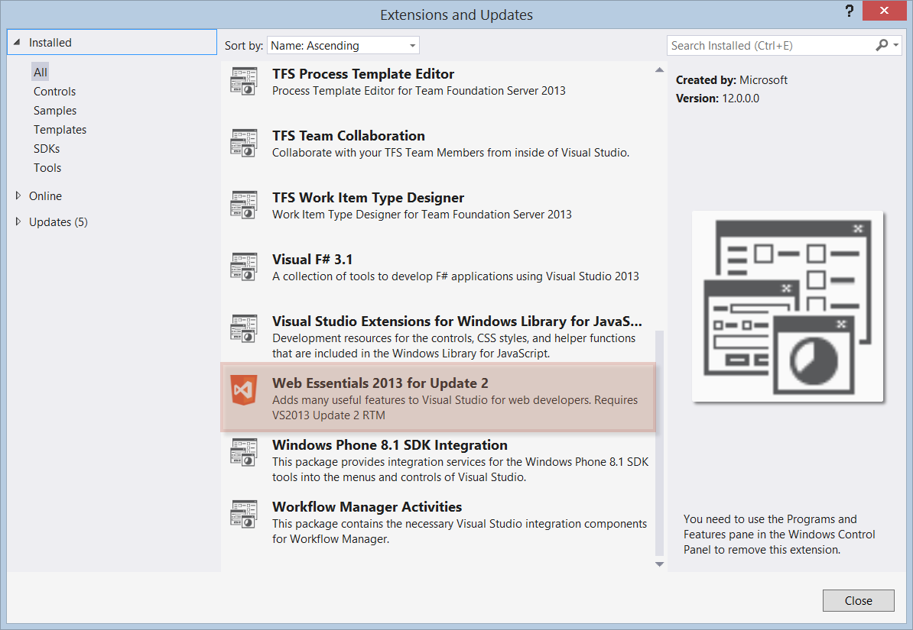

Web Essentials is a Visual Studio extension that greatly improves the productivity of web developers. More times than not, the features of Web Essentials make their way into Visual Studio itself.

<!--endintro-->

You can install Web Essentials from the **Tools** | **Extensions and Updates** menu.

::: good  
  
:::

Be sure to make sure your visual studio version and your web essentials version are the same.

You can find more information at the extensions website found here: http://vswebessentials.com/
