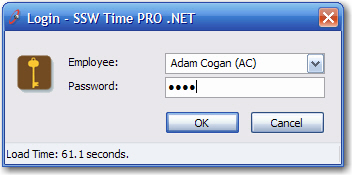
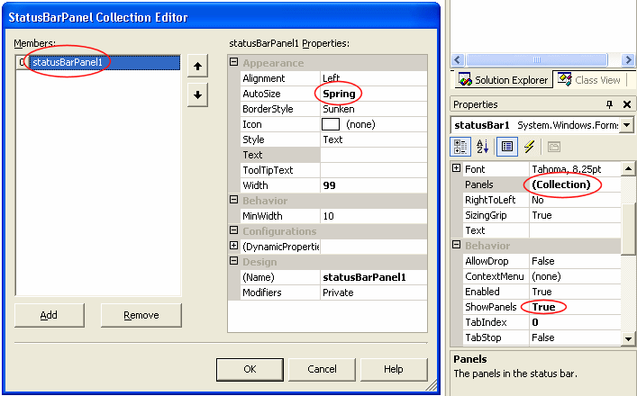

Every form should have a StatusBar that shows the time taken to load the form.

Developers can't catch and reproduce every performance issue in the testing environment, but when users complain about performance they can send a screenshot (which would including the time to load). Users themselves also would want to monitor the performance of the application. This is one of Microsoft Internet Explorer's most appalling missing feature, the status bar only says 'Done.' when the page is loaded - 'Done: Load Time 14 seconds'.

<!--endintro-->

In the figure below, the time taken to load the form over a dialup connection is 61.1 seconds, this proves to the developer that the form is not useable over a dialup connection. In this particular case, the developer has called a 'select \* from Employees' where it was not needed, only the name, password and ID is needed for this form.

**Note:** Once the form is loaded and load time is shown, the status bar can be used to show anything useful as the form is being used.

::: good

:::

Add a StatusBar to the form, and add a StatusBarPanel to the StatusBar, then set the properties like below.



```cs
private DateTime StartLoadTime = System.DateTime.Now;

private void Form1_Load(object sender, System.EventArgs e)
{
    TimeSpan elapsedLoadTime = DateTime.Now.Subtract(StartLoadTime);
    this.statusBarPanel1.Text = string.Format(
    "Load time: {0} seconds",
    Math.Round(elapsedLoadTime.TotalSeconds, 1));
}
```
