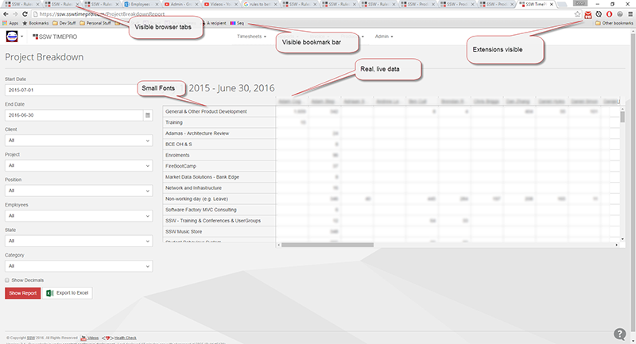

Most developers like to set up their screen efficiently – often that means small fonts, visible bookmark bars and a huge amount of browser tabs and taskbar items. While this is great for efficiency, it is not very good for recordings or presentations, and the clutter should be removed.

<!--endintro-->

Before recording your screen reduce visual noise by:

* **Removing unnecessary tabs** - Open the tab in its own window
* **Avoiding small fonts** - Zoom in to 125% by holding Ctrl and scrolling up on the mouse wheel. If you're using a 4K or large monitor, consider zooming further or increasing your display scale to 175% or 200% instead of the recommended 150%
* **Hiding the bookmark bar**

  * Windows shortcut: Ctrl + Shift + b
  * Mac shortcut: Cmd + Shift + b

::: bad

:::

::: good

:::
