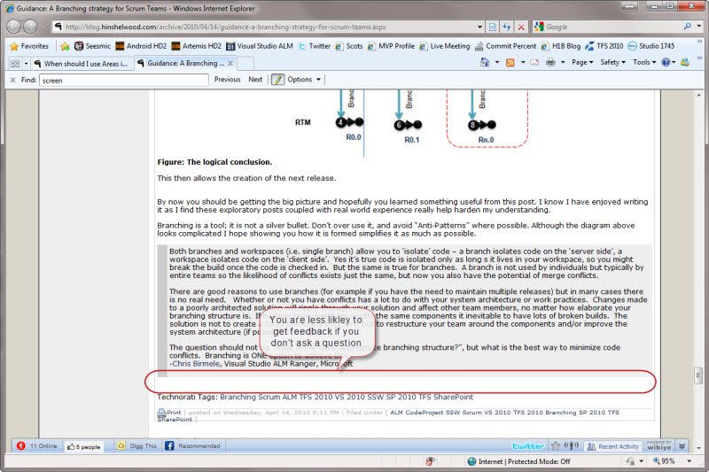

Whether you are converting an email to a blog post or writing it from scratch, always invite and instruct discussion.

<!--endintro-->

::: bad  
  
:::

::: good  
  
:::

Although people may not comply, it helps them adjust from the world of email only.
