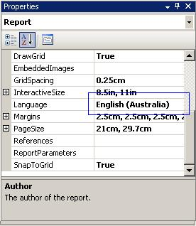
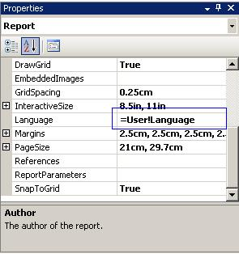
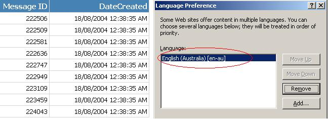
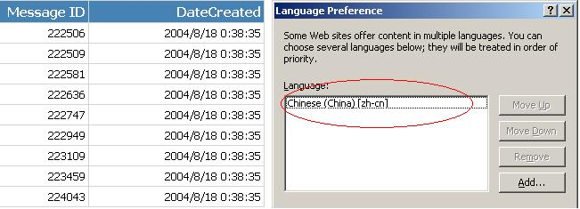

Developers too often change the 'Language' settings on reports in order to make it look ok for how they want to see it. Without realizing that they are now not supporting multiple cultures.

<!--endintro-->

To do this, you need to set the 'Language' to **"=User!Language"**. Then the report will recognize user client's culture settings, e.g. IE's languages settings.

Now you can specify this on either the culture sensitive controls or the whole report. Generally, is better specify this property on the whole report.

::: bad  
  
:::

::: good  

:::

::: good  

:::

::: good  

:::

::: info
**Warning: Adding the 'User' who printed the report, stops all data-driven subscriptions**

When you try to add the 'User' your data-driven subscriptions fail with the following error:

> 'The '/GroupHealth' report has user profile dependencies and cannot be run unattended. (rsHasUserProfileDependencies)'.

The reason is the report doesn't know which language to choose. The workaround is to add a user function to fallback the error to a default language, like: "en-AU"
:::

``` js
Public Function Language()
    Try
        Return Report.User!Language
    Catch
        Return "en-AU"
    End Try
End Function   
```

::: good  
Good example - Use above function to replace your reference to "Report.User!Language"/. It allows the subscription to work correctly
:::
