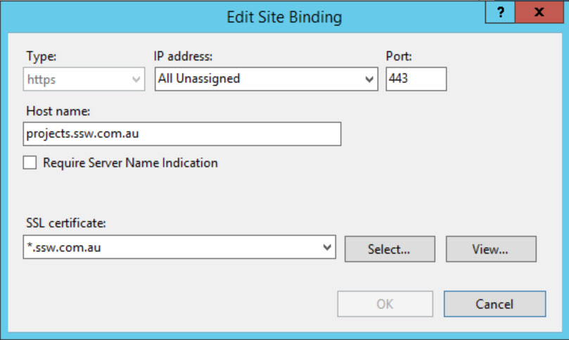
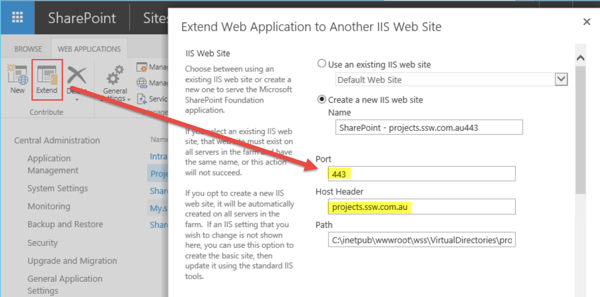

It is recommended to bind https by extending web applications in central admin site, rather than configuring in IIS

<!--endintro-->

::: bad
Bad example: Add https binding in IIS  
:::

::: good
Good example: Extend web application and assign https to the Internet zone  
:::
