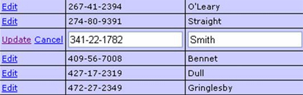
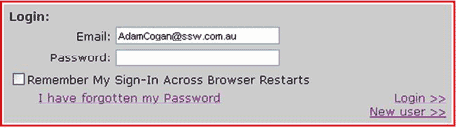
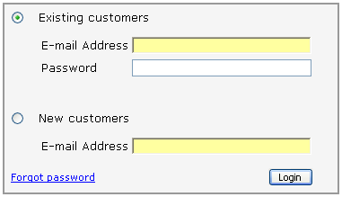

It seems nearly all web developers are confused whether they should use hyperlinks or buttons on forms. The recommendation is that whenever data is being submitted (e.g. Save, Cancel, Apply) you should use a button, otherwise use a link.

This is because hyperlinks indicate navigation - "If I click this link, I'll be taken somewhere else".

Whereas a button indicates that something is being processed - "When I click this, I'm agreeing that something is being submitted"

<!--endintro-->

#### Note: If you are using an automated link checker

It is important you use buttons for updating or deleting data on your website. The main reason is problems will occur when you run a link checker (e.g. [SSW CodeAuditor](https://codeauditor.com/)), and you have data driven pages with "Update" or "Delete" hyperlinks. The link checker will try to go to all associated links and potentially delete a lot of data from your website database.

But you say "My Delete links have JavaScript protection e.g. Are you sure you want to delete?". It is still no good because link checkers ignore all JavaScript validation.

Thus, we must have:

* Password protected areas on the website when we can update the database records via the web
* All update ability must be via buttons, not hyperlinks (as buttons are known on the web to submit a form).

That being said, there are a couple of exceptions to this rule.

1. If you want the user to be able to right click and "Open in New Window"
2. If you want a consistent design feel (and there is no confusion that the link is accepting data)

::: bad  
  
:::

::: good  
  
:::
