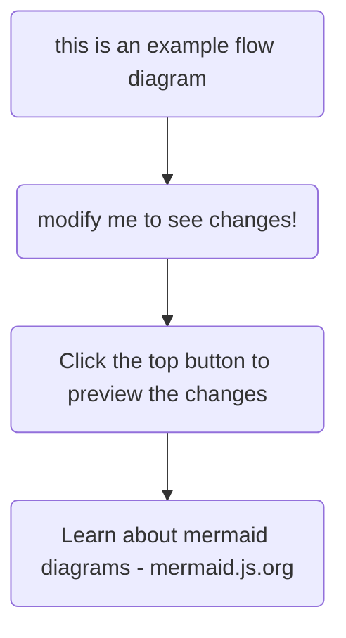

Hi

fjkjdsfkljsd\
sdfs\\

sdfsd\
sdfs\
ff\
fdfd

* sdfsdf
* sdfsdf

1. sdffffffff
2. sdfsd

fsdfsdfsdfsfsdfsd

This is just normal code

pdfsdfsdfsdf

| sdf   | sdfs  | sdfsd  |
| ----- | ----- | ------ |
| sdfsd | sdfsd | fsdfsd |
|       |       |        |
|       |       |        |



```cpp
for (int i=0; i < 100; i++)
{
   do the thing
}
```

<imageEmbed alt="Image" size="small" showBorder={false} figureEmbed={{ preset: "default", figure: "Gangster", shouldDisplay: true }} src="/uploads/rules/gert-rulez/Cat%20with%20Cigarette%20in%20Focus2.png" />

<imageEmbed alt="Image" size="small" showBorder={false} figureEmbed={{ preset: "default", figure: "YUM", shouldDisplay: true }} src="/uploads/rules/gert-rulez/ChatGPT Image Nov 18, 2025, 04_07_05 PM.png" />

<imageEmbed
  alt="Image"
  size="large"
  showBorder={false}
  figureEmbed={{
    preset: "default",
    figure: "chocolateeeee!!!",
    shouldDisplay: true
  }}
  src="/uploads/rules/gert-rulez/ChatGPT Image Nov 18, 2025, 04_11_57 PM.png"
/>

<emailEmbed
  from="Gert"
  to="Santa"
  cc="Rudolph"
  bcc=""
  subject="What's up!"
  shouldDisplayBody={true}
  body={<>
    ## Hi Santa
    
    I want a Ferrari
  </>}
  figureEmbed={{
    preset: "okExample",
    figure: "Gert's list",
    shouldDisplay: true
  }}
/>

<figureEmbed
  figureEmbed={{
    preset: "okExample",
    figure: "Not sure what this is for",
    shouldDisplay: true
  }}
/>

<asideEmbed
  variant="greybox"
  body={<>
    This is a grey box.
  </>}
  figureEmbed={{ preset: "default", figure: "XXX", shouldDisplay: true }}
/>

<asideEmbed
  variant="info"
  body={<>
    This is an info box.
  </>}
  figureEmbed={{ preset: "default", figure: "XXX", shouldDisplay: true }}
/>

<asideEmbed
  variant="todo"
  body={<>
    This is a Todo box.
  </>}
  figureEmbed={{ preset: "default", figure: "XXX", shouldDisplay: true }}
/>

<asideEmbed
  variant="china"
  body={<>
    This is a china box.
  </>}
  figureEmbed={{ preset: "default", figure: "XXX", shouldDisplay: true }}
/>

<asideEmbed
  variant="codeauditor"
  body={<>
    This is a Codeauditor box.
  </>}
  figureEmbed={{ preset: "default", figure: "XXX", shouldDisplay: true }}
/>

<asideEmbed
  variant="highlight"
  body={<>
    This is a highlight box.
  </>}
  figureEmbed={{ preset: "default", figure: "XXX", shouldDisplay: true }}
/>

<asideEmbed
  variant="warning"
  body={<>
    This is a warning box.
  </>}
  figureEmbed={{ preset: "default", figure: "XXX", shouldDisplay: true }}
/>

<asideEmbed
  variant="tips"
  body={<>
    This is a Tips box.
  </>}
  figureEmbed={{ preset: "default", figure: "XXX", shouldDisplay: true }}
/>

<youtubeEmbed url="https://youtu.be/uyoVO6ppLfs?si=xBDbc_wHqQ9uPk6N" description="🌽" />
