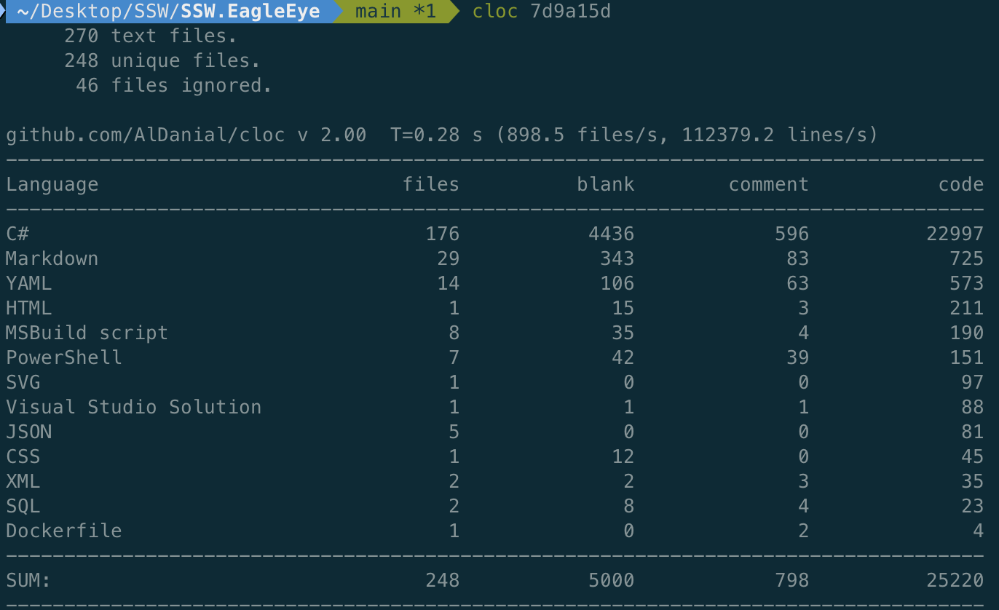

When working on software projects, it’s important to keep track of your codebase's size and structure. Code line metrics help you understand the scope of the code, identify potential areas for refactoring, and maintain a healthy balance between files, blank line comments, and code. Without these metrics, your project can become difficult to manage, and you may struggle to track progress or maintain code quality.

<!--endintro-->

## Using cloc to measure code line metrics

The tool [cloc](https://github.com/AlDanial/cloc) is a straightforward yet powerful way to count the number of files, blank lines, comment lines, and physical lines of source code across various programming languages. Here’s how you can use it effectively:

::: good

:::

### Understand the output

* **File Count:** The number of files in your project. Helps you understand the size and complexity
* **Blank Lines:** These can indicate the organization of your code. Provides insights into the readability
* **Comment Lines:** The number of lines that contain comments. Helps you gauge how well-documented the code is
* **Physical Lines of Code (LOC):** Counts the actual code lines, excluding blank lines and comments

### ✅ Benefits of tracking code metrics

Tracking code metrics with cloc helps in maintaining clean and well-documented code. It provides insights that can lead to:

* **Improved code quality:** By identifying parts of the code that are poorly documented or unnecessarily complex
* **Better project management:** Enabling project leads to assess the size and complexity of the codebase and plan accordingly
* **Code review efficiency:** Assisting in identifying files that have changed significantly and might require more thorough reviews

By integrating cloc into your workflow, you can ensure that your codebase remains manageable, maintainable, and well-documented as your project evolves.
