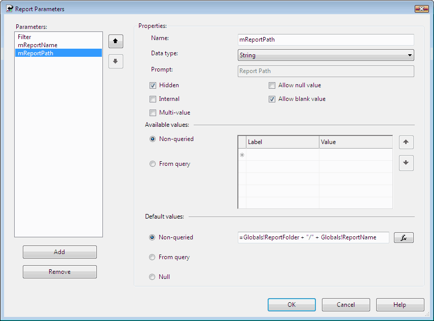
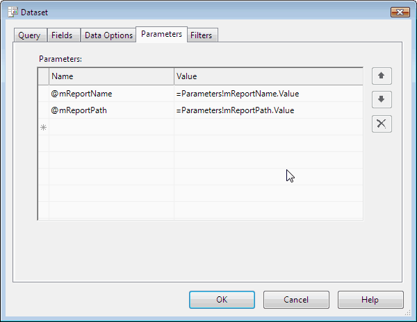

You can get email list in ExtensionSettings, which is an XML column in Subscriptions table in database of reporting services. Subscriptions table has a FK with Catalog table, which contains report name and report path information. Then we can XQuery the ExtensionSettings to get TO and CC fields according to report name and report path.

<!--endintro-->

See the following example. You need to fill report name and report path parameters(@mReportName and @mReportPath). Then this example will return the email dataset of the report's subscriptions.





```sql
DECLARE xmlCursor CURSOR FOR 
SELECT       ExtensionSettings
FROM         SubScriptions, [Catalog]
WHERE        SubScriptions.Report_OID = [Catalog].ItemID AND 
             [Catalog].Name = @mReportName AND 
             [Catalog].Path = @mReportPath 
DECLARE @settingsXML AS XML 
DECLARE @toEmail AS XML DECLARE @ccEmail AS XML
DECLARE @comment AS XML 
CREATE TABLE #subscrpt(toEmail XML, ccEmail XML, Comment XML) 
OPEN xmlCursor 
/* Perform the first fetch.*/ 
FETCH NEXT FROM xmlCursor INTO @settingsXML 
/* Check @@FETCH_STATUS to see if there are any more rows to fetch.*/ 
WHILE @@FETCH_STATUS = 0 BEGIN
    SELECT @toEmail = @settingsXML .query('data(/ParameterValues/ParameterValue [Name = "TO"]/Value)')
    SELECT @ccEmail = @settingsXML .query('data(/ParameterValues/ParameterValue [Name = "CC"]/Value)')
    SELECT @comment = @settingsXML .query('data(/ParameterValues/ParameterValue [Name = "Comment"]/Value)')
    INSERT INTO #subscrpt VALUES (@toEmail,@ccEmail,@comment) 
    /* This is executed as long as the previous fetch succeeds.*/ 
    FETCH NEXT FROM xmlCursor INTO @settingsXML 
END
SELECT toEmail, ccEmail, Comment FROM #subscrpt 
DROP TABLE #subscrpt 
CLOSE xmlCursor 
DEALLOCATE xmlCursor

```

::: good
Good example - Get email list
:::
