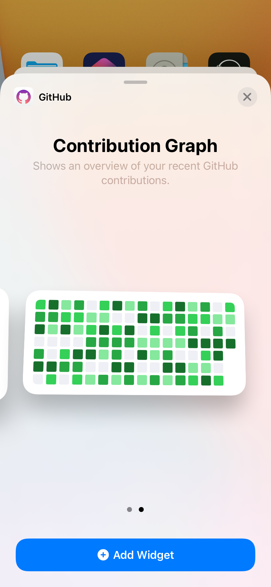

As a developer you're likely using GitHub all the time - it's one of the main repositories for code. When keeping a good work-life balance, it's not ideal for someone to be blocked by a pull request review that would take you 1 minute - just because you're out getting some fresh air.

<!--endintro-->

Having GitHub on your mobile helps you unblock people quickly, and leave comments all while you’re on the go. Devs are more productive [when they get regular breaks](/pomodoro) - so why not review pull requests in the park!

## ✅ Benefits of having GitHub on your phone

* **Unblock others** - Nothing is more frustrating for a developer than waiting hours or even days for a small PR approval or a comment on an issue

* **Stay updated** - It’s easier to fall behind on comments and issues if you’re only able to check GitHub from your computer

* **[Get notifications](/github-notifications)** - Custom notification settings are easy to set

### GitHub Contributions Widget

Seeing contributions can be a great motivator and helps you keep track of your activity. Add the GitHub contributions widget to your phone’s home screen to see recent contributions at a glance.

1. **iOS**:  
   * Tap and hold the home screen until the icons jiggle
   * Tap the “+” icon in the top-left corner and search for “GitHub”
   * Choose the GitHub contributions widget and place it on the home screen

2. **Android**:  
   * Tap and hold the home screen and select “Widgets”
   * Search for the GitHub contributions widget and add it to the home screen

::: good img-medium

:::
