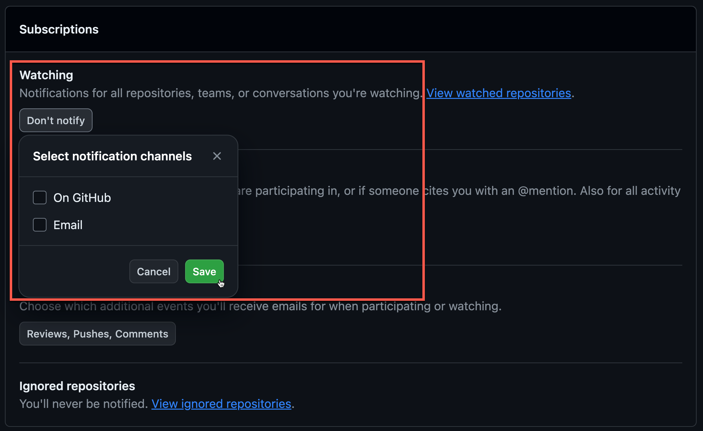
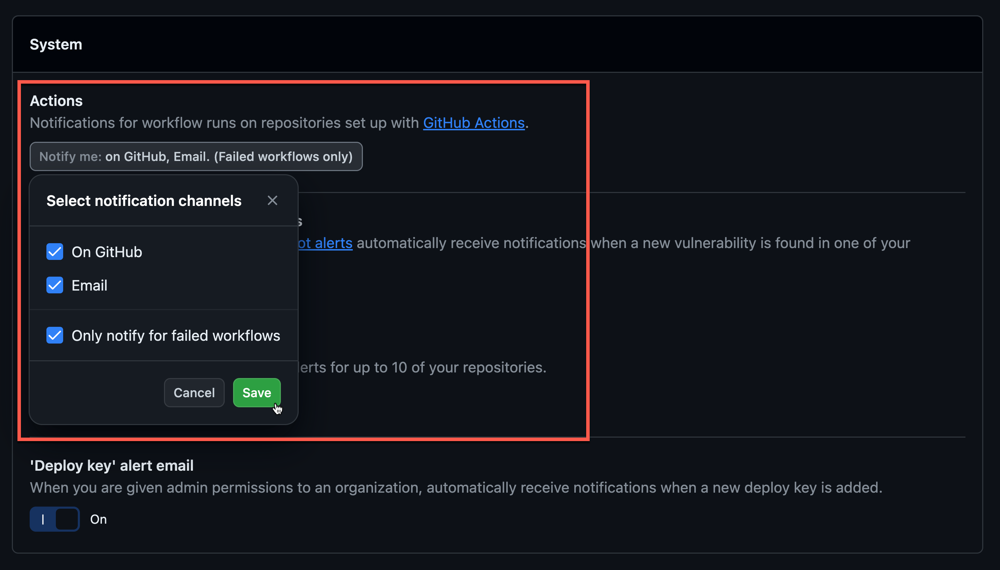
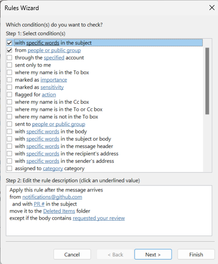

Notifications from GitHub can be quite a pain, as they send a lot of emails. This leads to many developers ignoring the important emails they receive.

<!--endintro-->

`youtube: https://www.youtube.com/embed/Lb1slP9jSGk`
**Video: Taming GitHub - Notification Hell 🔥 with Adam Cogan and Luke Parker (7 min)**

## Github

::: bad

:::

To reduce this spam and to make the notifications have value, make sure to configure your [GitHub Notifications](https://github.com/settings/notifications).

::: good

:::

Turning off Watching notifications significantly reduces the number of spam emails you receive. With this setting, you won't get notified about actions like PR approvals or comments that aren't related to you.

::: good

:::

The important one here is to make sure the item marked **Send notifications for failed workflows only** is checked, so that you receive emails for failures in your deployments.

## Outlook

You often want to receive emails when you’re @mentioned or someone requests your review on a pull request, but you probably don’t want to then subscribe to every future thing that happens about it.

You can add a rule in Outlook to automatically delete these:

