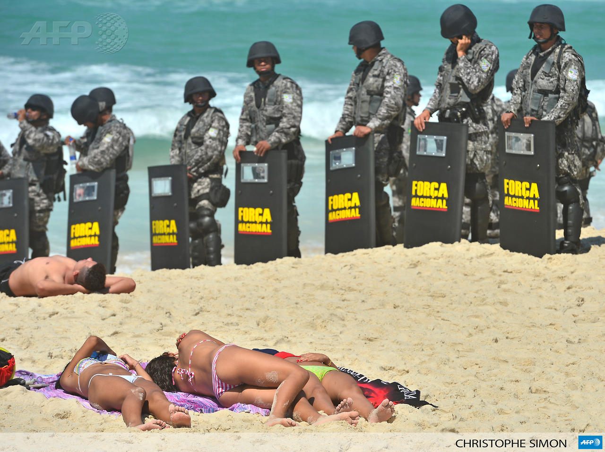

::: greybox
Give your employees a flexibility for small leave periods (say 1-3 days) and let it be 'auto-approved'. That means that employees will often take small periods of leave with little notice. However, this has big benefits for both employees and employers, as it removes the incentive for employees to lie and say they are 'sick' when they need time off with short notice.

:::

### For Employees:

Tell your managers and co-workers as soon as you know when you will be away. If you're planning to be away for any substantial amount of time (say 3 days or more), make sure you have told everyone who will need to know about 4 weeks in advance whenever possible. Most importantly, ensure that your clients are not left in a difficult position while you are gone.

<!--endintro-->

Generally, people who need to know include:

- Your managers
- Your current client
- Your close co-workers

**Appointment tips:**

- Put your name in the subject of the appointment (so someone scanning the leave calendar can see who's away easily)
- Add a brief description of why you're away (holiday, doctor, etc.)

::: email-template  
| | |
| -------- | --- |
| To: | SSWAbsence |
| Subject: | Patricia Barros - 2 weeks leave |  
::: email-content

### Hi SSW Absence,

I'm going to Brazil for 2 weeks on Monday... wish me luck :)

Thanks, Patricia

:::  
:::

::: bad  
Figure: Bad Example - not enough notice for substantial leave
:::

::: email-template  
| | |
| -------- | --- |
| To: | SSWAbsence |
| Subject: | Patricia Barros - 2 weeks leave |  
::: email-content

### Hi SSW Absence,

I want to book a ticket to go to Brazil for 2 weeks.
I'd like to leave in about 4 weeks. I will, of course, check with my client before I purchase my tickets.

Thanks, Patricia

:::  
:::  
::: good  
Figure: Good Example - appropriate notice given
:::

