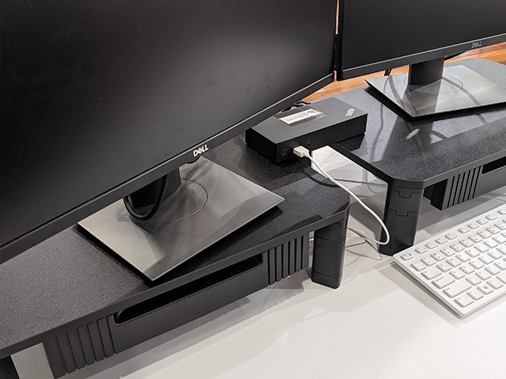
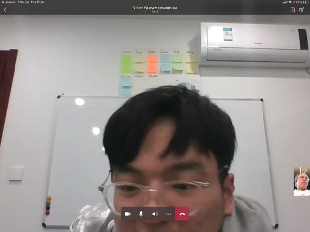

Communication can be difficult (even if English is your first language!). When using Microsoft Teams/Zoom, it might be tempting to only chat via text in IM, but this will not improve your skills or build a relationship as well as communicating verbally.

<!--endintro-->

::: good

:::

## Tips to have a better call

Try to always answer the call with video (if weak bandwidth, use it for the first 10 seconds and say _"I'll turn off video to save bandwidth"_).

### Sound

* Be ready with the headset already on (it looks disorganized setting it up after you are on the call)
* Check the sound quality of the microphone - you need a good mic and it should be close to your mouth - if you are using the laptop mic, sit in close

### Video

* Check the image quality of the camera
* Beware of the angle of the camera - laptops with thin bezels now put the camera at the base, looking up your nose. Avoid them. Frame your head and shoulders in the shot, and keep the camera lens at or above **eye level** - [use a stand if necessary](https://www.dicksmith.com.au/da/buy/kogan-height-adjustable-laptop-monitor-stand-kogan)

* Get your [video background right](/video-background)

  ::: bad
  
  :::

  ::: good
  
  :::

* Keep a light source on your face, and try to avoid sitting with a window behind you
* Have a microfiber cloth and wipe off the lens from time to time

### Text

* It's always helpful to confirm things you're talking about with typed text during the call (especially helpful for people with English as a second language)

---

For more info, see [how to look and sound great online](https://www.cnet.com/tech/computing/ultimate-webcam-tips-how-to-look-sound-great-online)

::: info
**Tip:** Help the other person with following this rule by taking a screenshot of a call with them, then give a mark /10 with good and bad feedback. E.g. Sound/video quality, background.
:::
