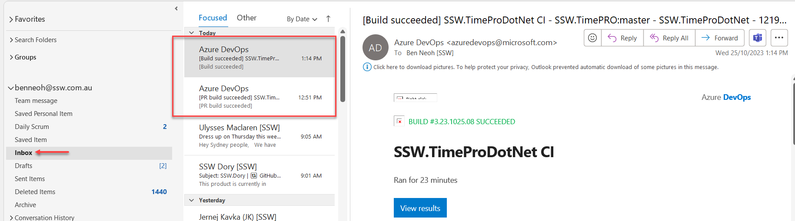
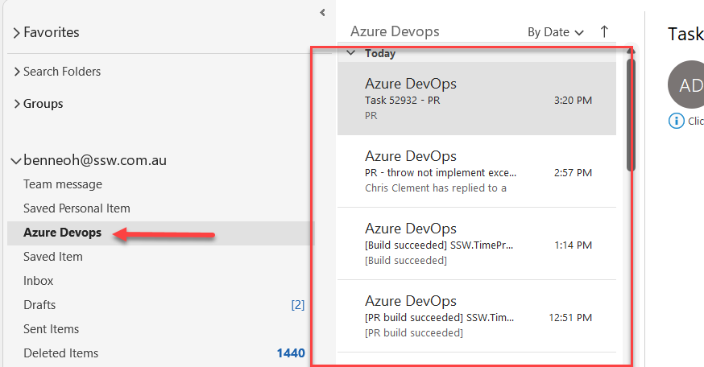

<!--endintro-->

Emails that are automatically generated can quickly overload your inbox with less important messages (e.g. notifications from Microsoft Teams, GitHub, Azure Devops, etc).

::: bad  

:::

You can create a folder and rules in your Microsoft Outlook to move cluttered emails out of the inbox based on the sender. Here are the [step by step guide](https://support.microsoft.com/en-gb/office/always-move-messages-from-a-specific-sender-e28d03c0-077d-4366-a348-4536f0fc9008)  on how to move email from specific senders to individual folder.

::: good  

:::
