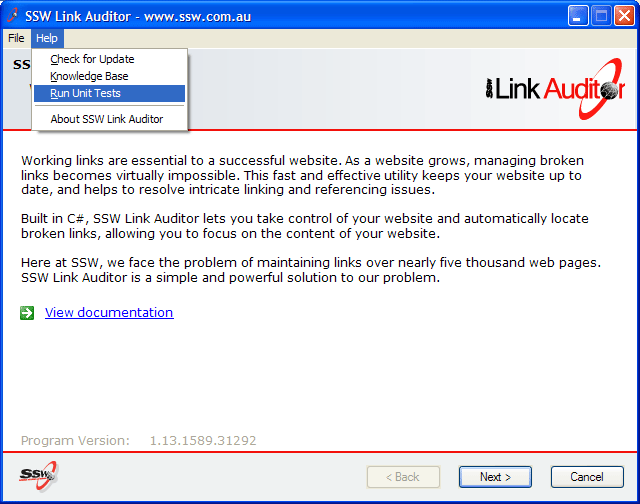
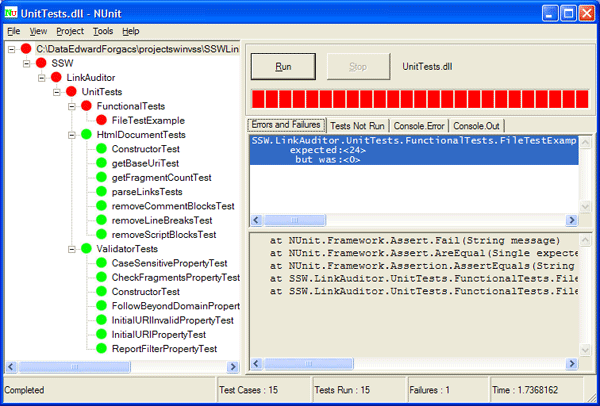

Your standard help menu should include an option to run your Unit Tests. Everybody knows the importance of Unit tests for the middle tier. However, Unit Tests are also important to capture problems that occur on other peoples' machines so that users can perform a quick check when a product is not behaving correctly. This is important for troubleshooting during support calls and enables your customers to do a Health Check on the product.

And yes, there are many tests that can be written that will pass on the developers PC - but not on the users PC. e.g. Ability to write to a directory, missing dlls, missing tables in the schema etc.

<!--endintro-->

**Note:** Adding this option requires you to include NUnit in your setup.exe (See [Include all the files needed](https://www.ssw.com.au/ssw/Standards/WiseSetup/WiseStandards.aspx#IncludeAllFiles) in our Wise Standard).

We have a rule [Do you know the Seven items every Help menu needs?](/menu-do-you-know-the-8-items-every-help-menu-needs)
