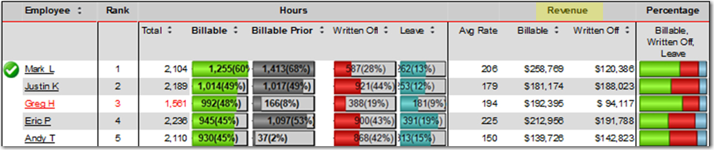
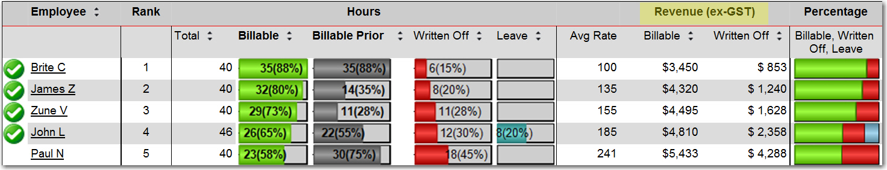

In reporting, total sales / revenue amount can be categorised as two types, which are include GST or exclude GST.

<!--endintro-->

It is very important to have clear labelling to avoid the user guessing on whether it includes GST or exclude GST.

::: bad  
  
:::

::: good  

:::
