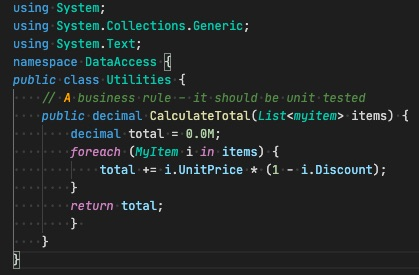
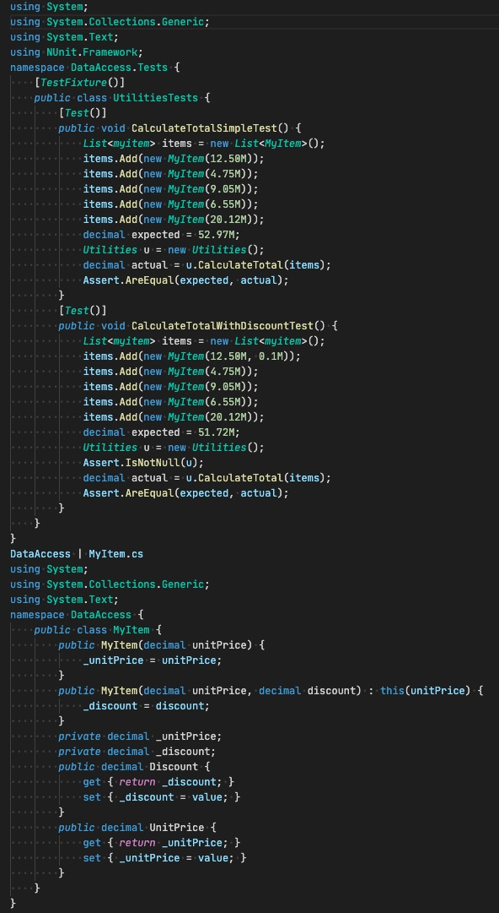

By difficult to spot errors, we mean errors that do not give the user a prompt that an error has occurred. These types of errors are common around arithmetic, rounding and regular expressions, so they should have unit tests written around them.

<!--endintro-->

**Sample Code:**

**Figure: Function to calculate a total for a list of items**

For a function like this, it might be simple to spot errors when there are one or two items. But if you were to calculate the total for 50 items, then the task of spotting an error isn't so easy. This is why a unit test should be written so that you know when the function doesn't work correctly.

**Sample Test:** (Note: it doesn't need a failure case because it isn't a regular expression.)

**Figure: Test calculates the total by checking something we know the result of.**
