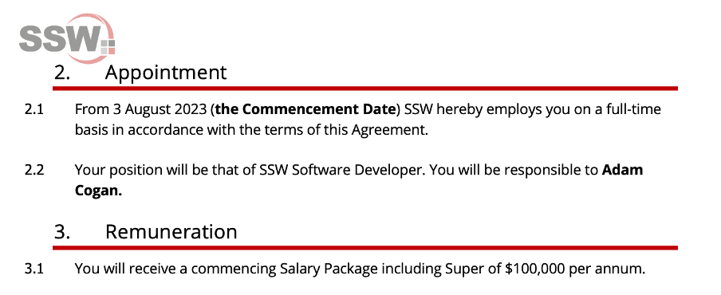
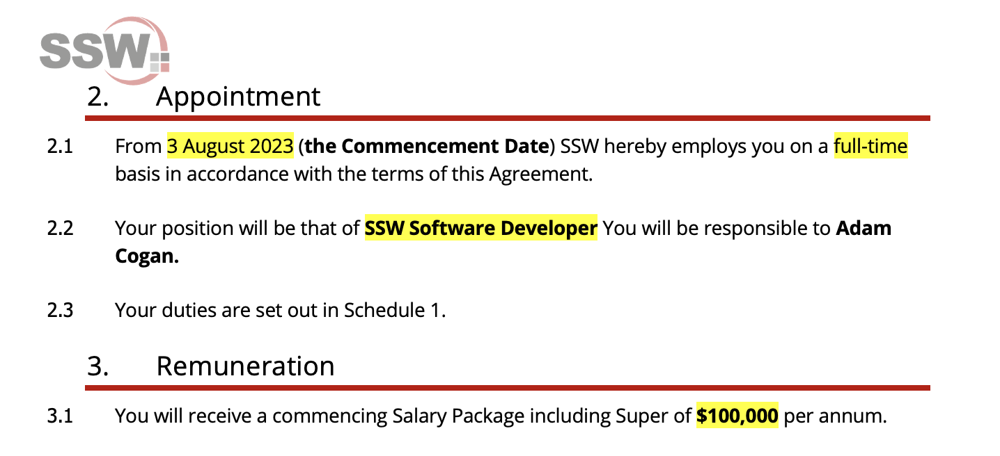

Contracts can be overwhelming to read and understand as they are often many pages and a [wall of text.](https://www.ssw.com.au/rules/screenshots-avoid-walls-of-text/) When you are asking someone to sign a contract, you must check they have read it, make sure they know they should get legal advice if they find it full of jargon, and hit the important points with them to ensure they know what they are agreeing to. 

<!--endintro-->

To make sure you don't miss any important info, you should find all the things you need to bring up and highlight them in <mark>yellow</mark>. This way, both parties get a summary of what the agreement is for, you each understand the terms and can remove any confusion. 

For example, on an employment contract you would use yellow highlight to check the new employee is aware of the conditions of their job. You should highlight things like: 

* Salary package amount 
* Job title
* Start date 
* Employment conditions such as company guidelines. 

::: bad

:::

::: good

:::
