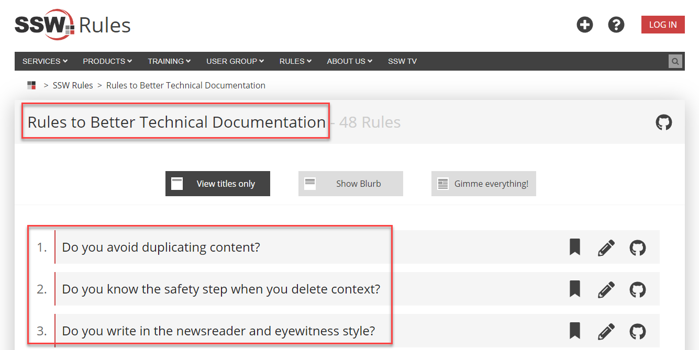

Using correct capitalization in titles and headings for web content is crucial.

For **main titles**, capitalize the first word, all nouns, verbs (even short ones like "is"), adjectives, and proper nouns. Conjunctions and prepositions should not be capitalized. E.g. "at", "on", "but", "and", "with", etc

**Subtitles/subheadings** should be written in regular sentence form, without additional capitalization.

<!--endintro-->

You can find more rules & tips about this subject in the article [Title Case: Capitalization of Titles, Headings, and Headlines](https://editorsmanual.com/articles/capitalizing-headings/)

::: greybox
**Title:** Exploring the future of Artificial intelligence

**Subtitle:** How AI Innovations Are Transforming Industries and Society
:::
::: bad
Figure: Bad example - Inconsistency on words' capitalization and capitalized subtitle
:::

::: greybox
**Title:**  Exploring the Future of Artificial Intelligence

**Subtitle:**  How AI innovations are transforming industries and society
:::
::: good
Figure: Good example - Consistent and correct capilalization on title and subtitle
:::

It's best to only do this on main titles, and leave subtitles in normal sentence form - only capitalize the first word and proper nouns. Basically, it saves hassles... English is a confusing language, and there are too many variations that cause too many arguments.

::: info
**Note:** We acknowledge the paradox in this page, as the title itself is not capitalized. The reason is because we structure SSW Rules content based on a category page. For example, [Rules to Better Technical Documentation](/rules-to-better-technical-documentation) is the main title, and every rule under it is considered a subtitle.
:::

::: good

:::
