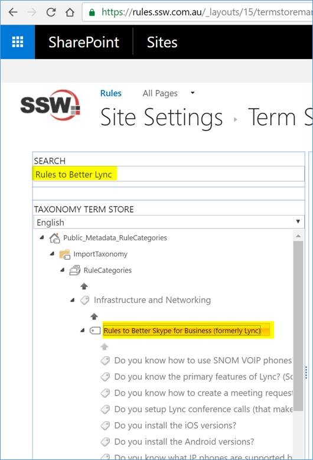
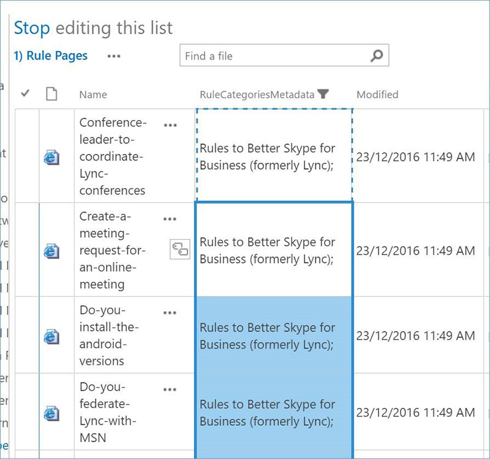

To update a rule category name in SharePoint, please follow these steps:

<!--endintro-->

1. **Rename “category name" in metadata:**
Search “Rules to Better Lync" to find it, double click the “term item title" to rename it to “Rules to Better Skype for Business (formerly Lync)"

  

2. **Rename “rule summary page" title:**
Go to the “Rule Summary page", edit its title with the new name “Rules to Better Skype for Business (formerly Lync)":
  

3. **Update “rule category field value" for sub-rules:**
    1. Use the left navigation to filter and find all the rules under this category. Use the 1st “tick icon" to select all of them, then click “ **Files** " | “ **Check Out** " to check them out:
  

    2. Use “Library" | “Quick Edit" to switch to “quick edit" mode:
  

    3. Update the 1st row with new “category name", then you can use “copy & paste" to update all the rest in one goal.
  

    4. Check-in and publish all the rules when you finish your modification.
4. **[Optional] Rename “page URL"**
