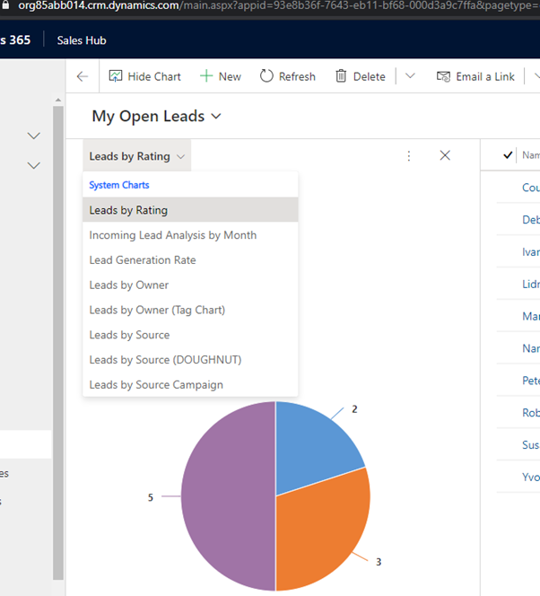
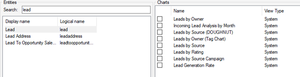
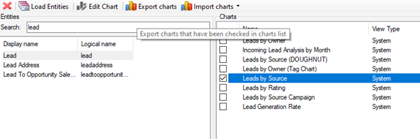
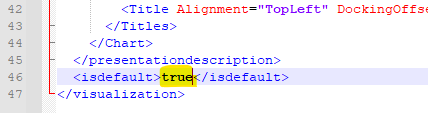
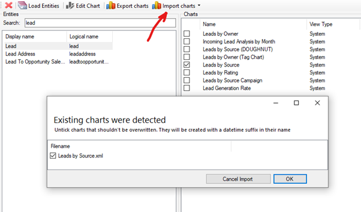
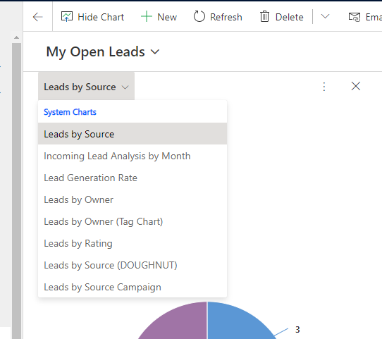
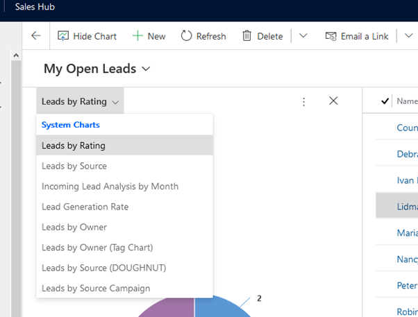

Model-driven apps allow you to create multiple charts per table, ordinarily, the first chart is the default chart when opening the charts pane. Setting a system-wide default chart takes a bit more work.

<!--endintro-->

In the example above “Leads by Rating" is the be the default system-level chart of the Lead table. Some additional work is required to change the default. The easiest way of doing this is with [XRMToolBox](https://www.xrmtoolbox.com/) and the [Advanced Chart Editor](https://crmchartguy.com/2017/06/10/edit-charts-in-the-xrmtoolbox-for-dynamics-365/) plugin.

1. Open the Advanced Chart Editor, Load Entities, and Navigate to the table

2. If changing the default chart to Leads by Source, select chart and export it

3. Open the exported XML file in the text editor of your choice, and change the **isdefault** element to “true" and save the file

4. Import the modified XML back into the Advanced Chart Editor and publish the changes

5. Refresh the Table view, the updated chart should be the default chart in the list

**Note:** If the chart that was modified to be the new default is not at the top of the list, check the first chart in the list by exporting it and confirming the **isdefault** element is set to false.

Where there are two charts with the **isdefault** element set to true, these default charts will be at the top of the list and sorted alphabetically.

For example, if “Lead by Rating" and “Lead by Source" are both set as default then they would both be at the top and sorted alphabetically. The remaining charts would then be sorted alphabetically.

This can be desirable in some instances.

